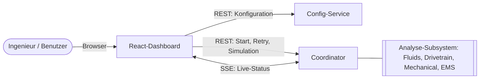
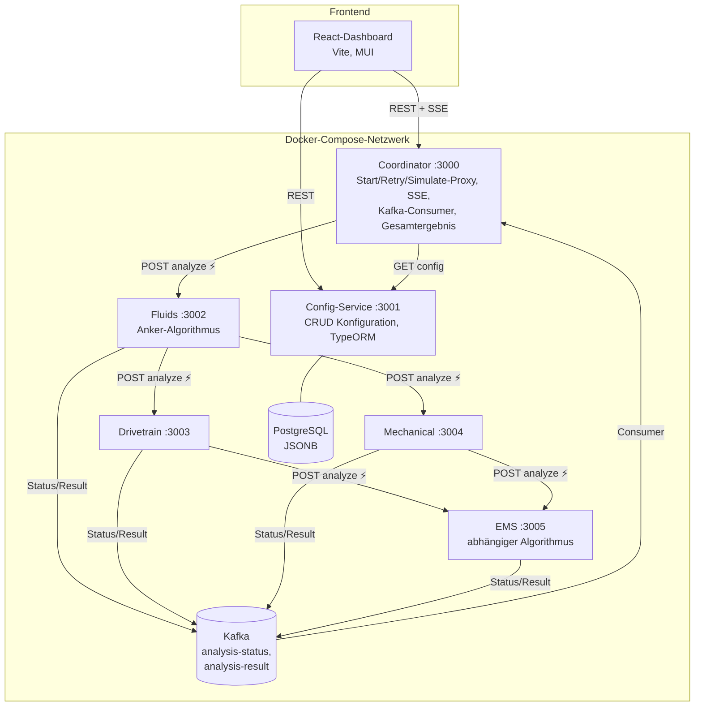

# arc42 — Analyse-Subsystem „WirSchiffenDas"

Teilprojekt „Entwicklung einer Choreographie von Microservices" (Übungsblatt Nr. 5, SEKA SS 2026).
Dokumentiert nach dem arc42-Template; Schwerpunkt auf den Abschnitten 4, 5, 6, 8 und 9.

---

## 1. Einführung und Ziele

Die Analyse-Komponente der Komponente „Manufacturing Products" validiert die Konfiguration
des Optional Equipments einer Diesel Engine. In der Bestandsanwendung sind alle
Validierungsalgorithmen in einer Klasse integriert; Status einzelner Algorithmen sind nicht
einsehbar, ein Retry einzelner Algorithmen ist nicht möglich.

**Ziele des Proof-of-Concept:**

| Ziel | Umsetzung |
|---|---|
| Nebenläufige Ausführung der Algorithmen | 4 choreographierte Microservices |
| Responsivität der übrigen Komponenten | asynchrone Ausführung (202 Accepted), UI bleibt bedienbar |
| Live-Status pro Algorithmus | proaktive Statusmeldungen über Kafka → SSE → UI |
| Retry einzelner Algorithmen | `POST /analysis/{runId}/retry/{cluster}` |
| Widerstandsfähigkeit bei Ausfall | Circuit-Breaker-Pattern (opossum) auf allen Service-zu-Service-Aufrufen |

**Stakeholder:** Geschäftsleitung (Auftraggeber PoC), Abteilung Technik, Ingenieur aus der
Anforderungsanalyse (Fachseite), Entwicklungsteam.

## 2. Randbedingungen

- REST-Endpoints für alle Service-Schnittstellen (Vorgabe Aufgabenblatt).
- Algorithmen werden simuliert (konstante Laufzeit `ALGORITHM_DURATION_MS` = 7 s pro Service).
- Technische Anforderungen: **MS_TA1** (Apache Kafka für Status-Nachrichten) und
  **MS_TA2** (Docker / Docker Compose) sind umgesetzt; Circuit Breaker über die
  Node.js-Bibliothek `opossum` (Alternative zu Resilience4j aus MS_TA3).
- Plattform: NestJS-Monorepo (Node.js/TypeScript), React + Vite für die Benutzeroberfläche.

## 3. Kontextabgrenzung



Externe Schnittstellen: ausschließlich der Browser des Benutzers. Nur Coordinator (3000)
und Config-Service (3001) sind aus dem Host-Netz erreichbar; die vier Algorithmus-Services
sind nur innerhalb des Compose-Netzwerks sichtbar.

## 4. Lösungsstrategie

1. **Zerlegung nach Equipment-Clustern:** je ein eigenständiger Microservice für
   Fluids (oilSystem, fuelSystem, coolingSystem), Drivetrain (powerTransmission,
   gearboxOptions), Mechanical (startingSystem, auxiliaryPto, mountingSystem,
   exhaustSystem) und EMS (engineManagementSystem, monitoringControlSystem).
2. **Choreographie statt Orchestrierung:** kein zentraler Dirigent — jeder Service ruft
   nach Abschluss seiner Arbeit den nächsten in der Kette auf. Der Coordinator startet nur
   den Anker (Fluids), sammelt Telemetrie und bedient das UI; er steuert den Ablauf nicht.
3. **Zwei getrennte Kommunikationskanäle:**
   - **REST/HTTP** für Aktivierung („führe deinen Algorithmus aus") — hierauf liegt der
     Circuit Breaker;
   - **Kafka** für proaktive Telemetrie (Status- und Ergebnis-Nachrichten) — Topics
     `analysis-status` und `analysis-result`.
4. **Asynchronität:** jeder `/analyze`-Aufruf antwortet sofort mit `202 Accepted`; die
   Analyse läuft im Hintergrund. Fortschritt erreicht den Benutzer über Kafka → Coordinator
   → Server-Sent-Events.
5. **Resilienz:** jeder Service-zu-Service-Aufruf ist in einen langlebigen Circuit Breaker
   pro Aufrufkante gekapselt; bei Nichterreichbarkeit veröffentlicht der **Aufrufer**
   stellvertretend den Fehlerzustand des toten Services, sodass der Gesamtablauf immer
   terminiert (kein Hängenbleiben, `Gesamtergebnis` wird immer berechnet).

## 5. Bausteinsicht

### 5.1 Ebene 1 — Übersicht



⚡ = Aufruf durch Circuit Breaker geschützt.

### 5.2 Wichtige Bausteine

| Baustein | Verantwortung | Wesentliche Elemente |
|---|---|---|
| **Coordinator** | Eingang für das UI; startet Prognosen; konsumiert Kafka; hält Zustand pro `runId` (Konfiguration, Status/Ergebnisse je Cluster); streamt SSE; berechnet Gesamtergebnis; Retry-Logik | `AnalysisController`, `AnalysisService` (In-Memory-Zustand, `ReplaySubject`), `ClusterGateway` (alle Breaker + Retry-Orchestrierung), `EventController` (Kafka), `SimulationController` (Proxy) |
| **Config-Service** | persistente Verwaltung der Optional-Equipment-Konfiguration | `Configuration`-Entity (JSONB), CRUD-REST |
| **Fluids** | Anker; eigener Algorithmus; ruft danach Drivetrain und Mechanical parallel | eigene Breaker `fluids→drivetrain`, `fluids→mechanical`, `fluids→ems` (nur für Fehlerfall) |
| **Drivetrain / Mechanical** | unabhängige Algorithmen; rufen danach EMS mit eigenen Ergebnissen (`upstreamResults`) | Breaker `→ems` |
| **EMS** | abhängiger Algorithmus: startet erst, wenn Ergebnisse **beider** Upstreams vorliegen; Ergebnis `failed`, sobald ein Upstream `failed` ist | Upstream-Cache pro `runId` (bleibt für Retries erhalten), Running-Guard, `DELETE /analyze/:runId` (Cache-Reset) |
| **libs/shared** | gemeinsamer Wortschatz und Querschnitt | Enums/DTOs/Messages, `CircuitBreakerFactory`, `buildFailedResults`, `SimulationController` + `SimulationStateService` (in allen 4 Algorithmus-Services registriert), Kafka-Provider, Swagger/Validation/Filter-Setup |

### 5.3 REST-Schnittstellen (Auszug)

| Service | Endpoint | Zweck |
|---|---|---|
| Coordinator | `POST /analysis/start` `{configId}` → `{runId}` | Analyse starten |
| Coordinator | `GET /analysis/:runId/stream` (SSE) | Live-Events `status` / `result` / `overall` |
| Coordinator | `POST /analysis/:runId/retry/:cluster` | einzelnen Algorithmus erneut ausführen |
| Coordinator | `GET /simulate`, `POST /simulate/:cluster/(down\|up)` | Ausfall-Simulation (Proxy zu den Services) |
| Config | `GET/POST/PUT /configs` | Konfigurations-CRUD |
| Algorithmus-Services | `POST /analyze` → `202` | Algorithmus anstoßen (Body: `runId`, `config`, optional `upstreamCluster`, `upstreamResults`) |
| Algorithmus-Services | `GET /simulate`, `POST /simulate/(down\|up)` | Ausfallzustand lesen/setzen (bei down: `/analyze` → `503`) |

## 6. Laufzeitsicht

### 6.1 Normaler Durchlauf

```mermaid
sequenceDiagram
    participant UI
    participant C as Coordinator
    participant F as Fluids
    participant D as Drivetrain
    participant M as Mechanical
    participant E as EMS
    participant K as Kafka
    UI->>C: POST /analysis/start {configId}
    C->>C: Config laden, runId erzeugen
    C--)F: POST /analyze (202, ⚡)
    C-->>UI: {runId}; UI öffnet SSE
    F--)K: status running … status ready + result
    F--)D: POST /analyze (⚡)
    F--)M: POST /analyze (⚡)
    par parallel
        D--)K: running / ready / result
        D--)E: POST /analyze {upstreamResults D}
    and
        M--)K: running / ready / result
        M--)E: POST /analyze {upstreamResults M}
    end
    E->>E: startet erst bei beiden Upstreams
    E--)K: running / ready / result
    K--)C: alle Events
    C--)UI: SSE status/result je Cluster, dann overall
```

Gesamtdauer ≈ 3 × 7 s (Fluids → Drivetrain‖Mechanical → EMS).

### 6.2 Ausfall eines Services (Circuit Breaker)

Szenario: Mechanical ist nicht erreichbar (simuliert oder Container gestoppt).

1. Fluids beendet seine Arbeit und ruft Drivetrain (ok) und Mechanical auf.
2. Der Aufruf an Mechanical schlägt fehl (Verbindungsfehler bzw. `503`); der Breaker
   `fluids→mechanical` öffnet und führt den **Fallback** aus:
   - Kafka: `status=failed` + alle Equipment-Ergebnisse `failed` für Mechanical
     (der tote Service kann sich nicht selbst melden — der Aufrufer meldet stellvertretend);
   - **On-Behalf-Aufruf an EMS** mit `upstreamCluster=mechanical, upstreamResults=failed`,
     damit die Choreographie terminiert (EMS wartet sonst ewig auf den zweiten Upstream).
3. EMS läuft mit (Drivetrain=ok, Mechanical=failed) → abhängiges Ergebnis `failed`.
4. Coordinator berechnet `Gesamtergebnis = failed`. **Das System hängt nie**; der Durchlauf
   dauert sogar kürzer, weil der tote Algorithmus nicht rechnet.
5. UI: Mechanical-Kachel `Failed` + Retry-Knopf; EMS `Ready` mit failed-Ergebnissen.

Sonderfall Anker: fällt **Fluids** aus, markiert der Fallback des Coordinators alle vier
Cluster als `failed` (downstream würde nie gestartet); das UI zeigt die nachgelagerten
Kacheln als `Blocked` und bietet Retry nur an der Ursache (Fluids) an.

### 6.3 Retry eines Algorithmus

Szenario: Mechanical wieder verfügbar, Benutzer klickt Retry.

1. `POST /analysis/:runId/retry/mechanical`.
2. Coordinator setzt den Zustand von Mechanical **und EMS** zurück (`overallEmitted=false`;
   veraltete EMS-Ergebnisse würden sonst ein verfrühtes Gesamtergebnis auslösen).
3. Die betroffenen Breaker werden **manuell geschlossen** (`breaker.close()`): ein manueller
   Retry ist die Aussage des Benutzers „der Service ist wieder da" — er darf nicht am noch
   offenen Circuit (Open-Fenster = `resetTimeout`) scheitern.
4. EMS-Cache wird zurückgesetzt; der Coordinator spielt die gespeicherten Ergebnisse des
   Geschwister-Clusters (Drivetrain) stellvertretend bei EMS ein.
5. Mechanical wird erneut aufgerufen → rechnet → ruft EMS; EMS hat beide Upstreams → rechnet
   neu → frisches `Gesamtergebnis`.

## 7. Verteilungssicht

Alle Bausteine laufen als Docker-Container in einem Compose-Netzwerk (ein `Dockerfile`,
Ziel-App über Build-Arg). Adressierung über Service-Namen (`http://mechanical:3004`, per
Env-Variablen injiziert). Kafka (KRaft) und PostgreSQL mit Healthchecks; Services starten
erst bei `service_healthy`. Nur Coordinator und Config-Service publizieren Ports zum Host.

## 8. Querschnittliche Konzepte

**Circuit Breaker (opossum), ein Breaker pro Aufrufkante, als Singleton im Service:**

| Parameter | Wert | Begründung |
|---|---|---|
| `timeout` | 5 000 ms | `/analyze` antwortet sofort mit 202; ein gesunder Service braucht Millisekunden |
| `errorThresholdPercentage` | 50 % | Standardwert; bei geringem Aufkommen öffnet praktisch der erste Fehler |
| `resetTimeout` | 10 000 ms | nach 10 s Half-Open-Probe |
| `errorFilter` | 4xx zählt nicht | ein 4xx (z. B. 404 unbekannte Config) ist eine gesunde Ablehnung, kein Ausfall |

Fallback-Matrix (der Aufrufer meldet stellvertretend):

| Kante | Fallback |
|---|---|
| Coordinator → Config | kein Fallback; `404` bzw. `503` an den Client (ohne Config kein Durchlauf) |
| Coordinator → Fluids | alle 4 Cluster `failed` (Anker tot ⇒ nichts startet je) |
| Fluids → Drivetrain / Mechanical | Kafka `failed` für den Cluster + On-Behalf-POST an EMS |
| Drivetrain / Mechanical / Fluids → EMS | Kafka `failed` für EMS (Duplikate unkritisch: idempotente Zustands-Updates, `overall` wird nur einmal emittiert) |

**Status vs. Ergebnis:** `status` (running/ready/failed) beschreibt den Lebenszyklus des
Algorithmus, `result` (ok/failed) das fachliche Analyseergebnis. EMS mit `status=ready`
und `result=failed` ist der reguläre Fall „abhängiger Algorithmus über fehlerhaftem Upstream".

**Ausfall-Simulation:** gemeinsamer `SimulationController` in allen Algorithmus-Services;
bei `down` wirft `/analyze` synchron `503` **vor** dem 202 — nur so registriert der Breaker
des Aufrufers den Fehler. Zustand ist über `GET /simulate` abfragbar (Quelle der Wahrheit
sind die Services; das UI lädt den Zustand beim Start; ein nicht erreichbarer Service wird
als `down` gemeldet).

**Beobachtbarkeit:** Breaker-Events (`failure`, `open`, `halfOpen`, `close`) werden in der
`CircuitBreakerFactory` zentral geloggt; Swagger-UI je Service; globale Validation-Pipe
(whitelist) und Exception-Filter aus `libs/shared`.

**Zustandshaltung (bewusste PoC-Entscheidung):** Läufe im Coordinator und der EMS-Upstream-
Cache liegen im Speicher (kein Neustart-Überleben, unbegrenztes Wachstum pro `runId`) —
für den PoC akzeptiert und im Code kommentiert.

## 9. Architekturentscheidungen

| # | Entscheidung | Begründung / verworfene Alternative |
|---|---|---|
| 1 | **Choreographie** statt Orchestrierung | Anforderung des Aufgabenblatts; kein Single Point of Control; Coordinator bleibt reiner Beobachter/Einstieg. Alternative (Coordinator ruft alle Services) wäre Orchestrierung |
| 2 | **Kafka für Telemetrie, REST für Aktivierung** | Status-Nachrichten sind proaktiv und 1→n (MS_TA1); Aktivierung braucht gezielte Zustellung + Fehlersemantik für den Breaker. Ein Kanal für beides vermischt Verantwortlichkeiten |
| 3 | **202 + Fire-and-Forget** statt synchroner Aufrufe | Responsivität (Kernanforderung); Aufrufer wartet nie 7-20 s. Konsequenz: Breaker-Timeout klein (5 s statt 25 s), Breaker prüft nur Erreichbarkeit, nicht den Algorithmus-Erfolg |
| 4 | **Fallback = Aufrufer meldet stellvertretend** (inkl. On-Behalf-Aufruf an EMS) | einziger Weg, mit dem der Gesamtablauf ohne Timeouts/Watchdogs immer terminiert; hält EMS frei von Ausfall-Wissen |
| 5 | **EMS-Upstream-Cache bleibt nach dem Lauf erhalten** + Reset-Endpoint | ermöglicht Retry einzelner Upstreams; Reset schließt die Stale-Cache-Race beim Komplett-Retry (Fluids) |
| 6 | **Manueller Retry schließt den Circuit** (`breaker.close()`) | UX: der Benutzer behauptet explizit „Service ist wieder da"; ohne close() liefe jeder Retry im Open-Fenster (10 s) ins Leere. Automatische Aufrufe bleiben durch das Open-Fenster geschützt |
| 7 | **opossum** statt Resilience4j/Spring-Netflix | Node.js-Stack (NestJS); opossum ist der etablierte CB für Node; erfüllt denselben Pattern-Kern (closed/open/half-open, Fallback, Timeout) |
| 8 | **JSONB für Equipment-Konfiguration** | Optional Equipment ist variabel; kein Schema-Update pro neuem Equipment |
| 9 | **Ein Dockerfile für alle Services** (Build-Arg `APP`) | Monorepo; identischer Build-Prozess; weniger Duplikation (MS_TA2) |
| 10 | **`libs/shared` auf Kontrakte + Technik beschränkt** (vgl. Anti-Pattern #11 „Shared Libraries", Schirgi/Brenner) | Geteilt werden nur Nachrichten-**Kontrakte** (Enums/DTOs) und technische Querschnittsbibliotheken (CB-Factory, Kafka-Setup) — laut abgeleiteter Lösung zu #11 zulässig. Domain-Wissen wurde bewusst entfernt: jeder Algorithmus-Service kennt nur die **eigene** Equipment-Liste; die vollständige Karte liegt allein beim Coordinator, der Failed-Ergebnisse zentral synthetisiert, sobald ein `status=failed` eintrifft. Fallbacks der Aufrufer melden nur noch den **Fakt** des Ausfalls (Kafka-Status bzw. Flag `upstreamFailed` Richtung EMS), keine fabrizierten Fremd-Ergebnisse. Die DB-Verbindungsdaten liegen lokal beim Config-Service (nicht in `shared`). Restschuld: `CONFIG` (Topologie-Defaults) — im Compose-Umfeld über Env-Variablen mit Service-Namen überschrieben |
| 11 | **Choreographie im Normalablauf, Coordinator-assistiertes Recovery** | Der Happy Path ist reine Choreographie (Coordinator startet nur den Anker und hört zu). Retry weicht bewusst ab (Replay der Geschwister-Ergebnisse, Breaker-Close): Recovery braucht historischen Lauf-Zustand, den nur der Kafka-Consumer (Coordinator) besitzt. Rein choreographisches Recovery würde Zustandshaltung pro `runId` in jedem Service erfordern |
| 10 | **`libs/shared` nur für Kontrakte + technische Querschnittsbibliotheken** | Bewusster Umgang mit dem Anti-Pattern *Shared Libraries* (#11, UB4): geteilt werden ausschließlich die Published Language (Enums, DTOs, Kafka-Messages/Topics) und Infrastruktur (CB-Factory, Kafka-Provider, Simulation, Swagger/Validation-Setup) — **kein Domain-Code**; jeder Algorithmus lebt nur in seinem Service. Restkopplung (Lockstep-Rebuild aller Container bei Shared-Änderung) für den Monorepo-PoC akzeptiert; im Produktivbetrieb würde `shared` als versioniertes npm-Paket veröffentlicht |
| 11 | **Sonnenschein-Fluss choreographiert, Recovery koordiniert** | Der normale Ablauf ist reine Choreographie: die Aufrufkette ist in den Services verankert, der Coordinator startet nur den Anker und beobachtet (Nachweis: fällt der Coordinator mitten im Lauf aus, terminiert die Analyse trotzdem — nur die Live-Anzeige stoppt). Der Retry-Pfad ist dagegen bewusst koordiniert (Sibling-Replay an EMS, Cache-Reset, `breaker.close()`): ein Retry einzelner Algorithmen benötigt naturgemäß die globale Sicht auf den Lauf, die nur der Coordinator besitzt. Der rein choreographische Retry existiert ebenfalls (Retry des Ankers = kompletter Neudurchlauf über die Kette selbst) |

## 10. Qualitätsanforderungen (Nachweis)

| Anforderung (Aufgabenblatt) | Nachweis |
|---|---|
| Responsivität | Start/Retry antworten < 100 ms; Analyse im Hintergrund |
| Live-Status pro Algorithmus | SSE-Events `running/ready/failed` je Cluster im Dashboard |
| Retry einzelner Algorithmen | Retry-Knopf je Kachel; verifiziert für alle 4 Cluster |
| Ausfall ⇒ System bleibt funktionsfähig | alle Ausfall-Szenarien (jeder der 4 Services einzeln, Anker, EMS, Kombinationen) terminieren mit `Gesamtergebnis=failed`, kein Hängen |
| EMS baut auf Vorergebnissen auf | EMS-Ergebnis `failed` ⇔ ein Upstream `failed`; sichtbar im Dashboard |

## 11. Risiken und technische Schulden

- In-Memory-Zustand (Coordinator, EMS) — Neustart verliert laufende Analysen; bewusst für PoC.
- Kein Schutz gegen Absturz eines Algorithmus **nach** Annahme (202): Kachel bliebe `running`
  (Abhilfe wäre Self-Report per try/catch oder Watchdog im Coordinator — außerhalb des Scopes).
- Ein Fehler öffnet den Circuit (volumeThreshold=0) — bei geringem PoC-Traffic gewollt.
- React-UI läuft außerhalb von Compose (Vite-Dev-Server) — optionale Erweiterung.
- `libs/shared` enthält noch Topologie-Defaults (`CONFIG`) — Rest von Anti-Pattern #11
  „Shared Libraries"; Domain-Wissen wurde bereits herausgelöst (siehe Entscheidung Nr. 10).
- Der Retry-Pfad ist Coordinator-assistiert und damit keine reine Choreographie
  (siehe Entscheidung Nr. 11).
