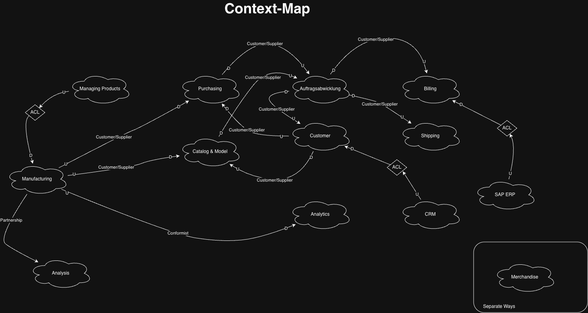
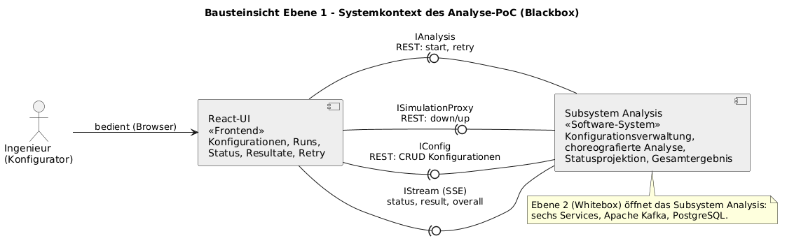
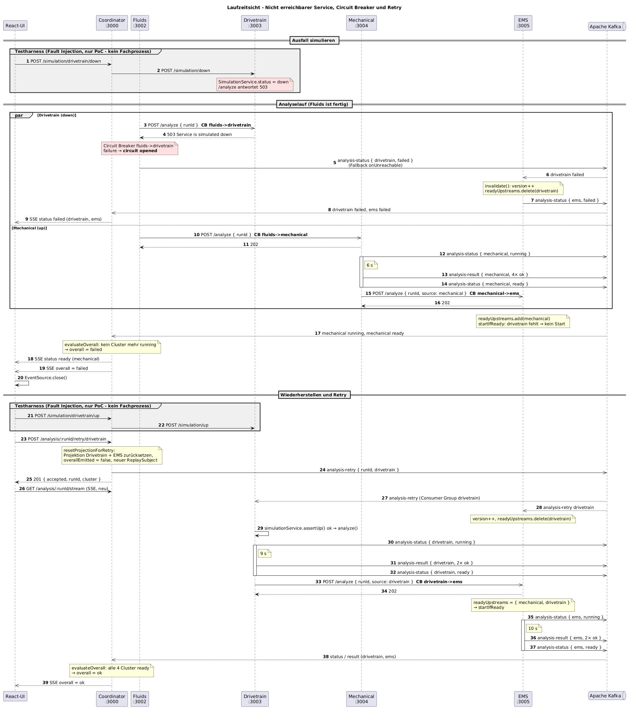
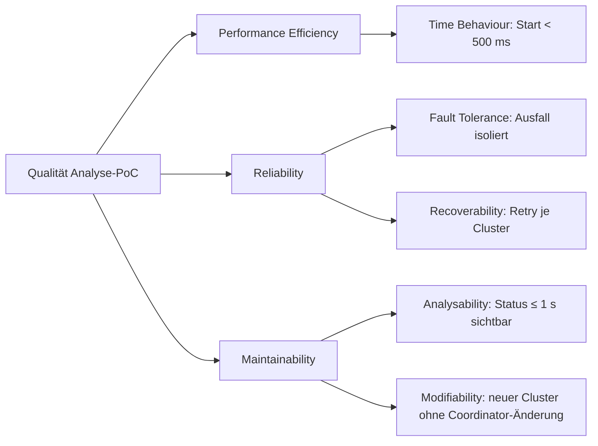
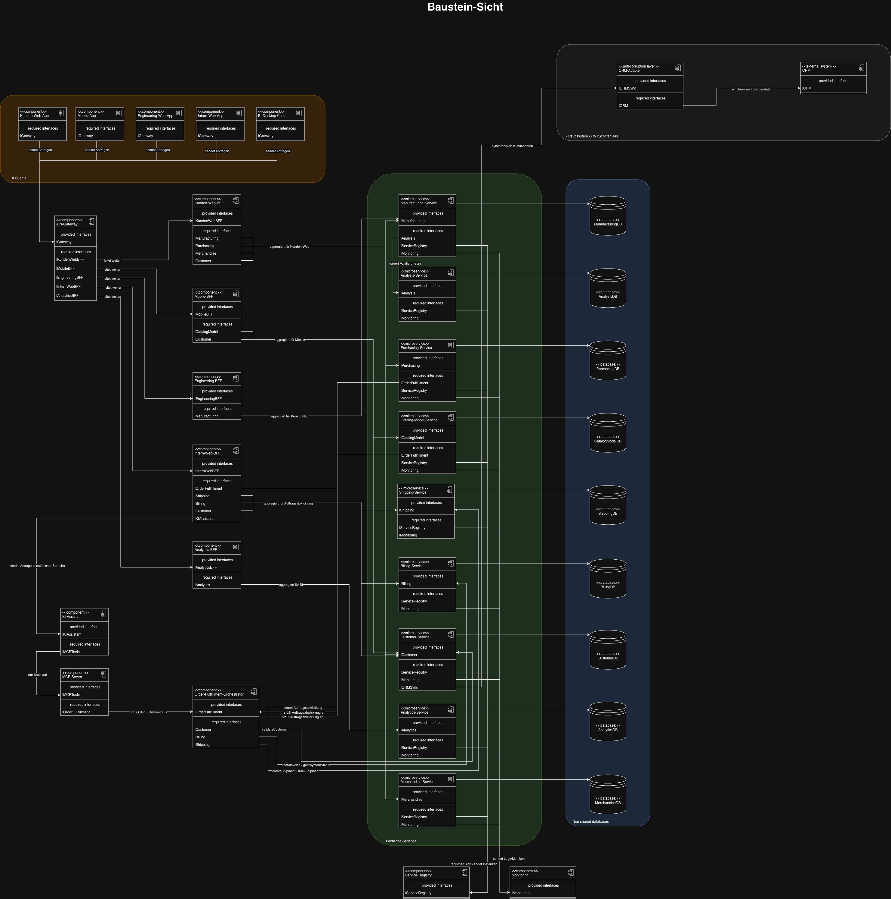

# arc42-Architekturdokumentation: Analyse des Optional Equipments

## 1. Einführung und Ziele

### 1.1 Aufgabenstellung

Die Anwendung ist ein Proof of Concept für die Analyse einer Konfiguration des Optional Equipments der Yachtmotor-Familie „Diesel Engine 2000 M96“. Die Analyse ist auf vier Algorithmus-Services verteilt: Fluids, Drivetrain, Mechanical und EMS. Ein React-Frontend verwaltet Konfigurationen, startet Analyseläufe, zeigt Status und Ergebnisse an und ermöglicht den Retry eines einzelnen Algorithmus.

Die implementierte Lösung verfolgt folgende Ziele:

| Ziel | Umsetzung im aktuellen System | Codebezug |
|---|---|---|
| Responsiver Start | `POST /analysis/start` erzeugt eine `runId`, startet Fluids asynchron und liefert zurück, ohne auf das Gesamtergebnis zu warten. | `analysis/apps/coordinator/src/controller/AnalysisController.ts`, `analysis/apps/coordinator/src/gateway/ClusterGateway.ts` |
| Sichtbarer Fortschritt | Jeder Algorithmus veröffentlicht `running`, `ready` oder `failed`; der Coordinator projiziert die Ereignisse und streamt sie per SSE an die UI. | `analysis/libs/shared/src/enums/AlgorithmStatus.ts`, `analysis/apps/coordinator/src/service/AnalysisService.ts` |
| Ergebnis pro Equipment | Erfolgreich ausgeführte Algorithmen veröffentlichen für ihre Equipment-Gruppe jeweils `ok`; die UI zeigt die Resultate pro Cluster an. | `analysis/apps/*/src/service/*Service.ts`, `analysis/libs/shared/src/messages/EquipmentResult.ts` |
| Gesamtergebnis | Sobald alle vier Cluster einen terminalen Status haben, berechnet der Coordinator `ok` oder `failed`. | `analysis/apps/coordinator/src/service/AnalysisService.ts` |
| Gezielter Retry | Die UI adressiert eine `runId` und einen Cluster; die Ausführung des Retries liegt beim jeweiligen Algorithmus-Service. | `analysis/apps/coordinator/src/gateway/ClusterGateway.ts`, `analysis/apps/*/src/controller/EventController.ts` |
| Begrenzung technischer Fehler | Alle automatischen REST-Übergänge der Choreografie sind durch Circuit Breaker geschützt. | `analysis/apps/*/src/client/*.ts`, `analysis/apps/coordinator/src/gateway/ClusterGateway.ts` |
| Persistente Konfiguration | Der Config-Service speichert Motormodell, Zylindervariante, Getriebetyp und Equipment-Auswahl in PostgreSQL. | `analysis/apps/config/src/entity/Config.ts`, `analysis/apps/config/src/service/ConfigService.ts` |

### 1.2 Qualitätsziele

| Priorität | Qualitätsziel (ISO 25010) | Szenario | Umsetzung |
|---|---|---|---|
| 1 | Reaktionsfähigkeit (Time Behaviour) | `POST /analysis/start` antwortet in < 500 ms mit `runId`, unabhängig von der Dauer der Algorithmen (5–10 s) | asynchroner Anker-Start, SSE-Push |
| 2 | Widerstandsfähigkeit (Fault Tolerance) | Ausfall eines Algorithmus-Services führt innerhalb von 5 s (CB-Timeout) zu `failed` für genau diesen Cluster; übrige Cluster laufen weiter | Circuit Breaker beim Aufrufer, Fallback publiziert Status |
| 3 | Beobachtbarkeit (Analysability) | Jeder Statuswechsel (`running/ready/failed`) ist ≤ 1 s nach Eintritt in der UI sichtbar | Kafka `analysis-status` → Coordinator → SSE |
| 4 | Wiederherstellbarkeit (Recoverability) | Retry eines einzelnen Clusters ohne Neustart des gesamten Runs; abhängige Cluster (EMS) werden invalidiert | `analysis-retry`, EMS-Versionierung |
| 5 | Modifizierbarkeit (Modifiability) | Ein neuer Algorithmus-Cluster kommt als eigener Service ohne Änderung an Coordinator hinzu | Choreografie, generische Topics |

Die Dauern 5, 6, 9 und 10 s stammen aus `ANALYSIS_DURATION_MS` in `analysis/apps/{fluids,mechanical,drivetrain,ems}/src/service/*Service.ts`, der CB-Timeout von 5 s aus `analysis/libs/shared/src/circuit-breaker/CircuitBreaker.ts`.

### 1.3 Stakeholder

| Rolle | Erwartung |
|---|---|
| Geschäftsleitung WirSchiffenDas | Proof of Concept für Microservices gegen die Haltung der Abteilung Technik |
| Ingenieur (Konfigurator) | Status je Algorithmus sichtbar, Retry einzeln, übrige Komponenten bleiben responsiv, Monitoring |
| Software-Architekt Entwicklungsteam | Nachweis, dass Analyse-Komponente ohne Blockade von Manufacturing zerlegbar ist |
| Betrieb | Container-Deployment, Health, zentrales Logging (offen, siehe §11) |
| Prüfer (Prof. Alda) | arc42, 4-Sichten-Modell in UML, Begründung über Patterns/Anti-Patterns |

### 1.4 Fachlicher Umfang

Die vier Algorithmus-Services bearbeiten die in `Equipment.ts` definierten elf Optional-Equipment-Gruppen des Diesel Engine 2000 M96:

- Fluids: Oil System, Fuel System, Cooling System
- Drivetrain: Power Transmission, Gearbox Options
- Mechanical: Starting System, Auxiliary PTO, Mounting System, Exhaust System
- EMS: Engine Management System, Monitoring/Control System

Die Algorithmen sind im PoC simuliert: Sie warten je nach Service 5, 6, 9 oder 10 Sekunden und erzeugen anschließend feste `ok`-Ergebnisse. Die gespeicherte Konfiguration wird beim Start auf Existenz geprüft, beeinflusst aber die simulierten Ergebnisse nicht (`analysis/apps/*/src/service/*Service.ts`).

## 2. Randbedingungen

### 2.1 Technische Randbedingungen

| Randbedingung | Implementierter Stand | Codebezug |
|---|---|---|
| Backend | Node.js 20 im Container, NestJS 11, TypeScript | `analysis/Dockerfile`, `analysis/package.json` |
| Frontend | React 18, Vite 5 und Material UI 5 | `analysis-ui/package.json` |
| Persistenz | PostgreSQL 16; TypeORM mit `synchronize: true` | `analysis/docker-compose.yml`, `analysis/apps/config/src/ConfigModule.ts` |
| Messaging | Apache Kafka 3.9.1; NestJS-Kafka-Transport | `analysis/docker-compose.yml`, `analysis/libs/shared/src/kafka/createKafkaOptions.ts` |
| Resilienz | Opossum Circuit Breaker mit 5 s Timeout, 50 % Fehlerschwelle und 10 s Reset-Zeit | `analysis/libs/shared/src/circuit-breaker/CircuitBreaker.ts` |
| Deployment | Docker Compose für Backend-Services, Kafka und PostgreSQL | `analysis/docker-compose.yml` |

### 2.2 Feste Ports und Adressen

Die Standardports stammen aus den jeweiligen `environment.ts`-Dateien: Coordinator 3000, Config-Service 3001, Fluids 3002, Drivetrain 3003, Mechanical 3004 und EMS 3005 (intern `/analyze`), Kafka 19092 im Compose-Netz und 9092 vom Host, PostgreSQL 5432; die Verteilungssicht in §7 zeigt dieselben Ports als Kommunikationspfade.

Die React-UI verwendet derzeit feste Entwicklungsadressen `http://localhost:3000` und `http://localhost:3001` (`analysis-ui/src/api.ts`). Sie ist nicht als Service in `analysis/docker-compose.yml` enthalten.

## 3. Kontextabgrenzung

### 3.1 Fachlicher Kontext

Die Systemgrenze umfasst die React-UI und die Analyse-Subsysteme. Innerhalb des Backends verwaltet der Config-Service die Konfigurationen; der Coordinator bildet den Einstieg und die UI-Projektion; vier Algorithmus-Services simulieren die Analyse. Externe Fachsysteme sind im Repository nicht angebunden.

Die UI übergibt beim Analyse-Start ausschließlich die UUID einer vorhandenen Konfiguration. Der Coordinator prüft diese UUID beim Config-Service, erzeugt eine neue `runId` und startet die Choreografie. Status und Ergebnisse eines Runs verlassen das Backend über einen SSE-Stream.

Der PoC realisiert den Bounded Context *Analysis* aus der Context Map (Abbildung unten, Quelle `docs/WirSchiffenDas.drawio`; SOLL-Bausteinsicht in Anhang B); der dort als Blackbox modellierte `Analysis-Service` ist hier als Whitebox mit sechs Bausteinen ausgeführt. `IAnalysis` entspricht dem Coordinator-Endpunkt.

### 3.2 Technischer Kontext

| Schnittstelle | Richtung | Vertrag |
|---|---|---|
| Config REST | UI → Config-Service | `GET /configs`, `POST /configs`; zusätzlich bietet der Service `GET /configs/:id` und `PUT /configs/:id` an. |
| Analyse REST | UI → Coordinator | `POST /analysis/start` mit `{ configId }`; `POST /analysis/:runId/retry/:cluster`. |
| Simulation REST | UI → Coordinator | `GET /simulation/statuses`; `POST /simulation/:cluster/up|down`. |
| SSE | Coordinator → UI | `GET /analysis/:runId/stream`; Ereignistypen `status`, `result`, `overall`. |
| Choreografie REST | zwischen Backend-Services | `POST /analyze` mit `AnalyzeRequest = { runId, source? }`. `source` ist nur für Aufrufe an EMS zulässig und dort auf Drivetrain oder Mechanical begrenzt. |
| Kafka-Status | Algorithmus-Services → Kafka → Coordinator und EMS | Topic `analysis-status`, Payload `{ runId, cluster, status }`; EMS wertet nur Drivetrain- und Mechanical-Status aus. |
| Kafka-Ergebnis | Algorithmus-Services → Kafka → Coordinator | Topic `analysis-result`, Payload `{ runId, cluster, results[] }`. |
| Kafka-Retry | Coordinator → Kafka → Algorithmus-Services | Topic `analysis-retry`, Payload `{ runId, cluster }`. |

Die Kafka-Consumer verwenden getrennte Gruppen (`coordinator`, `fluids`, `drivetrain`, `mechanical`, `ems`), damit die für einen Dienst bestimmten Ereignisse nicht mit einem anderen Dienst konkurrieren (`analysis/apps/*/src/main.ts`).

## 4. Lösungsstrategie

1. **Fluids als Anker:** Nach erfolgreicher Existenzprüfung der Konfiguration startet der Coordinator ausschließlich Fluids.
2. **Dezentrale Choreografie über REST:** Fluids startet Drivetrain und Mechanical parallel. Beide melden ihre Fertigstellung unabhängig per REST an EMS.
3. **Fan-in im EMS:** EMS startet erst, wenn Drivetrain und Mechanical für dieselbe `runId` als bereit registriert sind.
4. **Ereignisbasierte Beobachtung:** Alle vier Algorithmus-Services publizieren Status und Resultate über Kafka. Der Coordinator führt daraus ein flüchtiges Read Model pro Run.
5. **Push zur UI:** Der Coordinator überträgt Änderungen als SSE-Ereignisse. Die UI beendet die Verbindung nach dem `overall`-Ereignis und verbindet sich nach einem Retry neu.
6. **Lokale Resilienz:** Der aufrufende Baustein schützt jeden automatischen REST-Übergang mit einem Circuit Breaker. Ein technischer Aufruffehler wird als `failed`-Status des nicht erreichbaren Zielclusters publiziert.
7. **Dezentraler Retry:** Der Coordinator veröffentlicht nur ein generisches Kafka-Kommando. Der adressierte Algorithmus-Service besitzt die Wiederholungslogik.
8. **Getrennte Konfigurationspersistenz:** Nur der Config-Service greift auf PostgreSQL zu; die Algorithmus-Services halten keine Konfigurationsdatenbank.

## 5. Bausteinsicht

Die Bausteinsicht ist als UML-Komponentendiagramm in zwei Ebenen modelliert (Quellen in `docs/diagrams/*.puml`, gerendert mit PlantUML). Ebene 1 zeigt die React-UI und das Subsystem Analysis als Blackbox mit den drei angebotenen Schnittstellen; Ebene 2 öffnet das Subsystem als Whitebox mit den sechs Services, PostgreSQL, Kafka, den angebotenen und benötigten Schnittstellen sowie den sechs durch Circuit Breaker geschützten REST-Kanten. Die Farben-Legende markiert die Änderungen gegenüber dem Stand aus Übung 5 (grün neu, gelb geändert, grau unverändert) und die Herkunft der Technologien (OSS / In-house).

Eine ältere, editierbare Fassung ohne UML-Schnittstellen liegt zusätzlich als diagrams.net-Datei vor: [Baustein-Sicht.drawio](./Baustein-Sicht.drawio).

### 5.1 Whitebox Analyse-Subsystem

| Baustein | Verantwortung | Abhängigkeiten |
|---|---|---|
| Coordinator | Config-Existenzprüfung, Erzeugung der `runId`, Start des Ankers, Retry-Entry-Point, Simulation-Proxy, Run-Projektion, Overall-Berechnung, SSE | Config-Service, Fluids, Kafka; für Simulation zusätzlich alle Algorithmus-Services |
| Config-Service | CRUD und Persistenz der Motorkonfigurationen | PostgreSQL |
| Fluids | Analyse von Oil, Fuel und Cooling System; Start von Drivetrain und Mechanical | Drivetrain, Mechanical, Kafka |
| Drivetrain | Analyse von Power Transmission und Gearbox Options; Fertigmeldung an EMS | EMS, Kafka |
| Mechanical | Analyse von Starting System, Auxiliary PTO, Mounting System und Exhaust System; Fertigmeldung an EMS | EMS, Kafka |
| EMS | Fan-in von Drivetrain und Mechanical; Analyse von Engine Management System und Monitoring/Control System; Invalidierung veralteter Versuche | Kafka |

Der Coordinator besitzt keine direkte Startverbindung zu Drivetrain, Mechanical oder EMS. Die in seiner Umgebung konfigurierten URLs zu diesen Services werden nur vom Simulation-Proxy verwendet (`SimulationClient.ts`, `ClusterGateway.ts`).

## 6. Laufzeitsicht

### 6.1 Normaler Analyselauf

1. Die UI lädt oder erzeugt eine Konfiguration direkt über den Config-Service.
2. Die UI sendet `{ configId }` an `POST /analysis/start` des Coordinator.
3. Der Coordinator prüft die Konfiguration über den Circuit Breaker `coordinator->config`. Bei Erfolg erzeugt er eine UUID als `runId`, legt eine leere Run-Projektion mit `ReplaySubject(50)` an und ruft Fluids über `coordinator->fluids` auf.
4. Fluids publiziert `running`, wartet 5 Sekunden, publiziert seine drei Equipment-Resultate sowie `ready` und ruft Drivetrain und Mechanical ohne gegenseitige Reihenfolge auf.
5. Drivetrain und Mechanical laufen unabhängig. Sie publizieren ihre Status und Resultate und rufen EMS jeweils mit `{ runId, source }` auf.
6. EMS sammelt Drivetrain und Mechanical in `readyUpstreams`. Erst wenn beide vorhanden sind und der Run weder läuft noch abgeschlossen ist, startet die EMS-Analyse.
7. Der Coordinator konsumiert `analysis-status` und `analysis-result`, aktualisiert die Run-Projektion und sendet jedes Ereignis per SSE an die UI.
8. Sobald alle vier Cluster nicht mehr `running` oder unbekannt sind, erzeugt der Coordinator genau ein `overall`: `failed`, falls mindestens ein Cluster `failed` ist, sonst `ok`.

### 6.2 EMS-Fan-in

EMS akzeptiert am REST-Endpunkt `/analyze` nur `source = drivetrain` oder `source = mechanical`. Die Reihenfolge der beiden Meldungen ist beliebig, weil eine Menge die bereits bereiten Upstreams pro `runId` speichert. Zusätzlich konsumiert EMS `analysis-status`: Ein `ready` eines Upstreams ergänzt dieselbe Menge; ein `failed` invalidiert den aktuellen EMS-Versuch, entfernt den betroffenen Upstream und publiziert `failed` für EMS.

Die Ausführung startet nur bei vollständigem Fan-in. Mehrfache REST- oder Statusmeldungen führen wegen `Set`, `running` und `completed` nicht zu parallelen EMS-Läufen (`analysis/apps/ems/src/service/EmsService.ts`).

### 6.3 Retry

1. Die UI sendet `POST /analysis/:runId/retry/:cluster` und baut nach Annahme eine neue SSE-Verbindung auf.
2. Der Coordinator entfernt veraltete Teile seiner Projektion, setzt `overallEmitted` zurück, ersetzt den bisherigen `ReplaySubject` und spielt die weiterhin gültigen Clusterzustände in den neuen Stream ein.
3. Der Coordinator publiziert `{ runId, cluster }` auf `analysis-retry`.
4. Jeder Algorithmus-Service empfängt das Kommando in seiner eigenen Consumer Group. Fluids, Drivetrain und Mechanical führen es nur aus, wenn der adressierte Cluster ihrem eigenen Cluster entspricht. EMS wertet zusätzlich Upstream-Retries aus, um seinen Fan-in-Zustand zu invalidieren.

Die Read-Side-Invalidierung ist im Coordinator explizit definiert:

| Retry von | Zurückgesetzte Projektion |
|---|---|
| Fluids | Fluids, Drivetrain, Mechanical, EMS |
| Drivetrain | Drivetrain, EMS |
| Mechanical | Mechanical, EMS |
| EMS | EMS |

Ein Fluids-Retry setzt die normale Choreografie erneut in Gang. Ein Drivetrain- oder Mechanical-Retry wiederholt nur diesen Algorithmus und meldet danach erneut an EMS. Ein EMS-Retry startet EMS nur, wenn beide Upstreams noch bereit sind; andernfalls publiziert EMS `failed`.

### 6.4 Nicht erreichbarer Service und Circuit Breaker

Die Circuit Breaker liegen an den tatsächlichen automatischen HTTP-Aufrufern:

| Aufruf | Circuit Breaker | Fallback im Code |
|---|---|---|
| Coordinator → Config-Service | `coordinator->config` | 404 wird als „Config nicht gefunden“ behandelt; sonst antwortet der Coordinator mit „Config service unavailable“. |
| Coordinator → Fluids | `coordinator->fluids` | publiziert `failed` für Fluids, Drivetrain und Mechanical; die Upstream-Fehler führen im EMS zu dessen eigenem `failed`. |
| Fluids → Drivetrain | `fluids->drivetrain` | publiziert `failed` für Drivetrain. |
| Fluids → Mechanical | `fluids->mechanical` | publiziert `failed` für Mechanical. |
| Drivetrain → EMS | `drivetrain->ems` | publiziert `failed` für EMS. |
| Mechanical → EMS | `mechanical->ems` | publiziert `failed` für EMS. |

Der Circuit Breaker wiederholt den fachlichen Lauf nicht. Er begrenzt den REST-Aufruf und übersetzt die Nichterreichbarkeit in einen technischen Clusterstatus. Der explizite Retry bleibt davon getrennt.

Für die Ausfallsimulation besitzt jeder Algorithmus-Service einen `/simulation`-Controller. Der Coordinator reicht die UI-Aufrufe über `SimulationClient` weiter. Ist ein Service als `down` markiert, verweigert sein Controller den Start; beim Retry prüft der Service den Simulationszustand erneut (`analysis/libs/shared/src/simulation/*`).

## 7. Verteilungssicht

`analysis/docker-compose.yml` startet acht Container: die sechs NestJS-Anwendungen aus demselben Multi-Stage-Dockerfile (Build auf `node:20`, Laufzeit `node:20-slim`, Build-Argument `APP`), `apache/kafka:3.9.1` als KRaft-Broker und `postgres:16` mit dem Volume `wirschiffendas-configdb-data`. Zum Host veröffentlicht sind die Ports 3000 (Coordinator) und 3001 (Config-Service); Kafka 9092 und PostgreSQL 5432 sind nur für die lokale Entwicklung freigegeben.

Jeder Anwendungscontainer besitzt einen Compose-`healthcheck` auf `GET /health` (`analysis/libs/shared/src/health/HealthController.ts`); Kafka und PostgreSQL prüfen sich über `kafka-topics.sh` und `pg_isready`. Die Algorithmus-Container warten per `depends_on` auf den Kafka-Healthcheck, der Config-Service auf PostgreSQL, der Coordinator auf Kafka, Config-Service und Fluids (`condition: service_healthy`). Die React-UI wird im aktuellen Compose-Modell nicht gebaut oder gestartet.

## 8. Querschnittliche Konzepte

### 8.1 Circuit Breaker

Die gemeinsame Implementierung basiert auf Opossum. Sie existiert als Decorator für Service-Clients und als Fabrik für dynamisch konfigurierte Aufrufe im `ClusterGateway`. Zustandswechsel (`failure`, `open`, `halfOpen`, `close`) werden mit dem NestJS-Logger protokolliert. Fallbacks publizieren den `failed`-Status des Zielclusters, aber keine synthetischen Equipment-Resultate.

### 8.2 Status-Telemetrie über Kafka

`KafkaClient` kapselt die drei Topics `analysis-status`, `analysis-result` und `analysis-retry`. Die Algorithmus-Services sind Produzenten für Status und Resultate. Der Coordinator konsumiert Status und Resultate für sein Read Model. EMS konsumiert zusätzlich Status seiner beiden Upstreams. Alle fünf konsumierenden Anwendungen verwenden eigene Consumer Groups.

### 8.3 Server-Sent Events

`AnalysisService` hält pro `runId` einen `ReplaySubject(50)`. Status-, Result- und Overall-Ereignisse werden unverändert als SSE-Datenobjekte weitergegeben. Der Speicher ist prozesslokal und nicht persistent. Nach einem Overall schließt die UI den `EventSource`; nach einem Retry ersetzt der Coordinator den Stream und die UI verbindet sich neu.

### 8.4 Invalidierung veralteter EMS-Läufe

Jeder EMS-Run besitzt eine monoton erhöhte `version`. Beim Ausfall oder Retry eines Upstreams wird die Version erhöht und der aktuelle Lauf als nicht mehr laufend und nicht abgeschlossen markiert. Der asynchrone EMS-Lauf merkt sich seine Startversion und verwirft nach der Wartezeit sein Ergebnis, falls sich die Version geändert hat. Dadurch kann ein verspäteter Lauf weder Resultat noch `ready` für einen inzwischen ungültigen Zustand publizieren.

### 8.5 Ausfallsimulation

`SimulationService` und `SimulationController` in `analysis/libs/shared/src/simulation/` implementieren eine Fault Injection: `POST /simulation/:cluster/down|up` (über den Coordinator, `analysis/apps/coordinator/src/client/SimulationClient.ts`) setzt den Zustand eines Algorithmus-Services, dessen `/analyze` daraufhin mit 503 antwortet (`SimulationService.assertUp()`). Das ist eine PoC-Variante des Stabilitätsmusters Test Harness nach Nygard (Kapitel 5): Der Aufrufer wird gegen einen absichtlich fehlerhaften Partner geprüft, ohne den Fachprozess zu verändern. In Produktion ist der Auslöser ein realer Ausfall (etwa `docker compose stop drivetrain`); das Verhalten der Circuit Breaker in `analysis/apps/*/src/client/*.ts` ist in beiden Fällen identisch.

## 9. Architekturentscheidungen

### ADR-001: Choreografie statt zentraler Orchestrierung

- **Status:** akzeptiert
- **Kontext:** Der Coordinator ist der zentrale HTTP-Einstieg, die Aufgabe verlangt aber eine Choreografie der Algorithmus-Services.
- **Entscheidung:** Der Coordinator startet nur den Anker Fluids. Fluids startet Drivetrain und Mechanical; diese melden sich selbst bei EMS. EMS besitzt die Fan-in-Regel. Der Coordinator kennt den normalen fachlichen Ablauf nach dem Anker nicht als ausführbaren Prozess.
- **Konsequenzen:** Der Happy Path bleibt dezentral. Die Reihenfolge von Drivetrain und Mechanical ist nicht festgelegt. EMS benötigt lokalen Zustand pro Run. Die zentrale Run-Projektion ist Beobachtung und nicht Ablaufsteuerung.
- **Codebezug:** `AnalysisController.ts`, `FluidsService.ts`, `DrivetrainService.ts`, `MechanicalService.ts`, `EmsService.ts`

### ADR-002: Koexistenz von REST und Kafka

- **Status:** akzeptiert
- **Kontext:** Startübergänge benötigen eine direkte Annahme oder Ablehnung; Status, Resultate und Retry sollen unabhängig von einer offenen HTTP-Kette verteilt werden.
- **Entscheidung:** REST `/analyze` bildet die automatischen Übergänge der Choreografie ab. Kafka transportiert Status, Resultate und Retry-Kommandos. SSE überträgt die vom Coordinator aggregierte Sicht an den Browser.
- **Konsequenzen:** REST-Aufrufe können lokal durch Circuit Breaker geschützt werden. Kafka entkoppelt Produzenten von der UI-Projektion. Der Betrieb benötigt neben den sechs Services auch einen Kafka-Broker. EMS verwendet beide Kanäle: REST für positive Fertigmeldungen und Kafka-Status zur Erkennung von Upstream-Fehlern.
- **Codebezug:** `analysis/apps/*/src/client/*.ts`, `analysis/libs/shared/src/kafka/*`, `analysis/apps/*/src/controller/EventController.ts`

### ADR-003: Dezentraler Retry als Kafka-Kommando

- **Status:** akzeptiert
- **Kontext:** Die UI benötigt einen einheitlichen Retry-Endpunkt, ohne dass der Coordinator die Wiederholungslogik jedes Algorithmus ausführt.
- **Entscheidung:** Der Coordinator validiert den Clusternamen, bereinigt ausschließlich sein Read Model und publiziert `{ runId, cluster }` auf `analysis-retry`. Jeder Algorithmus-Service interpretiert das Kommando in seinem eigenen Kontext.
- **Konsequenzen:** Der Coordinator bleibt Entry Point und Projektion. Ein Retry von Fluids setzt die Choreografie fort; Drivetrain und Mechanical melden erneut an EMS; EMS verwaltet die Invalidierung abhängiger Zustände. Die getrennten Consumer Groups sind für die Zustellung an alle beteiligten Services erforderlich.
- **Codebezug:** `ClusterGateway.ts`, `AnalysisService.ts`, `analysis/apps/*/src/controller/EventController.ts`, `EmsService.ts`

### ADR-004: Reduzierter `AnalyzeRequest`

- **Status:** akzeptiert
- **Kontext:** Die simulierten Algorithmen verwenden weder die vollständige Konfiguration noch Upstream-Ergebnislisten für ihre Berechnung.
- **Entscheidung:** `AnalyzeRequest` enthält nur `runId` und optional `source`. `source` darf ausschließlich `drivetrain` oder `mechanical` sein und wird für den EMS-Fan-in verwendet. Die vollständige Konfiguration verbleibt im Config-Service; der Coordinator prüft beim Start nur ihre Existenz.
- **Konsequenzen:** Der Vertrag entspricht dem tatsächlich genutzten Datenbedarf des PoC und reduziert Kopplung. Die erzeugten Analyseergebnisse sind daher Simulationsergebnisse und keine aus den gespeicherten Equipment-Werten berechneten Resultate.
- **Codebezug:** `analysis/libs/shared/src/dtos/AnalyzeRequest.ts`, `StartAnalysisRequest.ts`, `AnalysisController.ts`, `analysis/apps/*/src/service/*Service.ts`

## 10. Qualitätsanforderungen

### 10.1 Qualitätsbaum

### 10.2 Qualitätsszenarien

| ID | Stimulus | System-Reaktion | Messgröße |
|---|---|---|---|
| QS-1 | UI startet Analyse | `runId` zurück, Algorithmen laufen im Hintergrund | Antwortzeit < 500 ms |
| QS-2 | Drivetrain ist `down` | Fluids-CB öffnet, publiziert `failed` für Drivetrain; Mechanical läuft weiter; EMS `failed` | ≤ 5 s bis Status, kein Blockieren anderer Cluster |
| QS-3 | Retry Drivetrain nach `up` | Nur Drivetrain + EMS laufen erneut, Fluids/Mechanical-Resultate bleiben | Projektion setzt genau 2 Cluster zurück |
| QS-4 | Kafka nicht erreichbar beim Start | Services starten nicht (`depends_on`), kein inkonsistenter Zustand | bekannte Grenze, siehe §11 |

## 11. Risiken und technische Schulden

| # | Schuld / Risiko | Bezug (Schirgi & Brenner) | Begründung im PoC | Gegenmaßnahme |
|---|---|---|---|---|
| TS-1 | `libs/shared` enthält Domänen-Code (Cluster, Equipment, DTOs, Messages); ein `package.json`, ein Dockerfile für alle Services | Anti-Pattern Shared Libraries (IV.B.2) | Monorepo-Build: Vertrag wird zur Build-Zeit geteilt, nicht zur Laufzeit; ein Team, ein Release-Zyklus | Kontrakte in Schema Registry (Avro/JSON Schema) auslagern; pro Service eigenes `package.json`; Domänen-Enums nicht mehr teilen |
| TS-2 | UI ruft Coordinator und Config-Service direkt auf | No API Gateway (IV.B.3) | Zwei Endpunkte für einen PoC; Gateway wäre reiner Proxy | API Gateway / BFF vor Coordinator + Config, wie in der SOLL-Architektur der Firma modelliert |
| TS-3 | Ursprünglich kein `/health` in den Services; Compose-Healthcheck nur für Kafka/PostgreSQL | No Health Check (IV.B.4) | erledigt (GET /health, Compose healthcheck) | `HealthController` in `analysis/libs/shared/src/health/`, `healthcheck` je Service in `analysis/docker-compose.yml`; Coordinator wartet mit `service_healthy` auf Config, Fluids und Kafka |
| TS-4 | Logging nur auf stdout je Container, kein zentrales Logging, kein Monitoring | Local Logging, Insufficient Monitoring (IV.B.4) | Ausserhalb des PoC-Scopes; Ingenieur fordert Monitoring | Loki/Grafana oder ELK; Correlation-ID = `runId` ist bereits in jeder Nachricht |
| TS-5 | Coordinator hält Run-Projektion in-memory (`ReplaySubject`), EMS hält Fan-in-Zustand in `Map` | Horizontal Scalability (IV.A.4) | Zustand ist run-lokal und kurzlebig | Projektion in Redis; EMS-Zustand persistieren; Kafka-Partitionierung nach `runId` |
| TS-6 | Aufrufer publiziert `failed` für einen nicht erreichbaren Zielservice (z. B. Fluids für Drivetrain) | Status-Ownership (eigene Beobachtung) | Run muss einen terminalen Zustand erreichen; Ziel kann selbst nichts publizieren | Eigener Status `unreachable` statt `failed`, um technische von fachlicher Störung zu trennen |
| TS-7 | Algorithmen lesen die Konfiguration nicht; Ergebnis immer `ok` | ADR-004 | Simulation der Abläufe, nicht der Fachlogik | Ein Cluster liest Config und liefert `failed` für eine definierte Equipment-Kombination |
| TS-8 | Keine API-Versionierung, keine CI/CD-Pipeline im Repository | No API Versioning, No CI/CD (IV.B.3) | PoC, ein Konsument | `/v1/`-Prefix; GitLab-CI mit Build/Test/Push je Service |
| TS-9 | `TypeORM synchronize: true` | — | PoC | Migrations |
| R-1 | Kafka at-least-once: doppelte Status-Nachrichten möglich | — | EMS idempotent über `version`, Coordinator über `overallEmitted` | Message-Key = `runId`, Deduplikation im Consumer |

## 12. Glossar

| Begriff | Bedeutung |
|---|---|
| Cluster | Fachliche Gruppe von Optional-Equipment-Algorithmen, die ein eigener Service ausführt (`fluids`, `drivetrain`, `mechanical`, `ems` in `Cluster.ts`). |
| Anker-Algorithmus | Der Algorithmus, den der Coordinator als einzigen direkt startet und der die Choreografie auslöst; im PoC Fluids. |
| Run / `runId` | Ein Analyselauf für eine Konfiguration, identifiziert durch eine UUID, die jede Nachricht und jedes SSE-Ereignis trägt. |
| Choreografie | Ablaufsteuerung, bei der jeder Service selbst entscheidet, wen er nach seiner Arbeit aufruft, ohne zentrale Prozessinstanz. |
| Orchestrierung | Ablaufsteuerung, bei der eine zentrale Instanz den Prozess kennt und die Services Schritt für Schritt aufruft; im PoC bewusst nicht gewählt (ADR-001). |
| Fan-in | Zusammenführen mehrerer unabhängiger Vorgänger in einem Schritt; EMS startet erst, wenn Drivetrain und Mechanical für dieselbe `runId` bereit sind. |
| Circuit Breaker | Schutzmuster am Aufrufer, das einen fehlschlagenden Remote-Aufruf nach Timeout oder Fehlerquote unterbricht und einen Fallback ausführt (Opossum). |
| Read Model / Projektion | Vom Coordinator aus Kafka-Ereignissen abgeleiteter, flüchtiger Zustand je Run, der nur der Anzeige dient und keinen Ablauf steuert. |
| Consumer Group | Kafka-Konsumentengruppe; jeder Service hat eine eigene, damit jeder Service jede Nachricht eines Topics erhält. |
| SSE | Server-Sent Events, ein unidirektionaler HTTP-Stream vom Coordinator zum Browser für Status, Resultat und Overall. |
| Optional Equipment | Auswählbare Ausrüstungsgruppen des Diesel Engine 2000 M96 (z. B. Oil System, Gearbox Options), die je Cluster analysiert werden (`Equipment.ts`). |

## Anhang A: Bewertung der Statements (Übung 4a)

Die acht Statements stammen aus dem Meeting der Bereichsleitung Technik (Übungsblatt Nr. 4, S. 1–2). Die Nummern `#n` verweisen auf die Zeilen der Anti-Pattern-Bewertung in Anhang C.

1. **„Wir haben eine strenge Komponenten- und Schichtenbildung, entsprechend haben wir auch Komponenten- und Schichtenteams. Das kann nur Vorteile haben, das wird übernommen!“** Nach Conways Gesetz reproduzieren Schichtenteams den Schichtenschnitt der Software, also genau den technischen Schnitt, der im IST als zentraler „Microservice“ um den Business Layer kritisiert wird. Für Microservices sind cross-funktionale Feature-Teams je Bounded Context zu empfehlen, die UI, Logik und Daten eines Kontexts gemeinsam verantworten (Unterauer 2017). Im PoC verantwortet ein Team den Kontext Analysis vollständig, von der React-UI bis zu den vier Algorithmus-Services → Wrong Cut (#7).
2. **„Die Geschäftsführung muss für so eine geringfügige Architekturänderung nicht informiert werden. Auch die Integration von modernem KI-Support ist unbedenklich.“** Die Einführung von Microservices ist keine geringfügige Änderung, sondern eine organisatorische Entscheidung über Teams, Betrieb und laufende Kosten für Container-Plattform, Message-Broker und Monitoring, und gehört deshalb zur Geschäftsführung. KI-Unterstützung erfordert zusätzlich Governance zu Daten, Haftung und Freigaben, siehe Anhang B; der unkritische Einsatz experimenteller Technik im Kundenkontakt ist im IST bereits als Problem sichtbar → Too new technology (#13).
3. **„Wir sind cloud-ready und somit auch horizontal skalierbar!“** Eine VM mit der gesamten Anwendungsschicht ist ein einziges Deployment-Artefakt, das sich nur als Ganzes replizieren lässt; das ist Vertikal- oder Ganzsystem-Skalierung, keine horizontale Skalierung einzelner Komponenten. Shipping mit saisonaler Sommerlast und die Analyse-Komponente brauchen individuelle Skalierung, die das IST ausdrücklich als „technisch nicht möglich“ ablehnt. Der PoC liefert einen Container je Service mit eigenem Lebenszyklus (`analysis/docker-compose.yml`) → Independent Deployment (#3), Horizontal Scalability (#4).
4. **„Ach immer dieses API-Team …“** Die Beschwerden erklären sich aus dem Zuschnitt der GP-API als God-API: serverseitige UI-Aggregation, Business-Logik und alle Kanäle (iPhone, Desktop, Web, Data Analyst) laufen durch eine Komponente und ein Team, das damit zum Engpass jeder Änderung wird. Die Optimierung ist ein schlankes API Gateway mit einem Backend-for-Frontend je Kanal (Newman, BFF-Pattern), sodass jedes Frontend-Team seine Aggregation selbst besitzt. Die SOLL-Bausteinsicht in `docs/WirSchiffenDas.drawio` modelliert genau das mit `API-Gateway`, `Kunden-Web-BFF`, `Mobile-BFF`, `Engineering-BFF`, `Intern-Web-BFF` und `Analytics-BFF` → Decentralization (#6), No API Gateway (#16).
5. **„Die Analyse-Komponente ist DAS Problem überhaupt!“** Die konkreten Probleme sind: alle Algorithmen in einer Klasse, ein synchroner Aufruf ohne Timeout blockiert die gesamte Manufacturing-Komponente, kein sichtbarer Status, kein Retry eines einzelnen Algorithmus und Fehlersuche nur im lokalen Log-File. Die Lösungsstrategie ist genau dieser PoC: ein Service je Cluster, asynchroner Start mit sofortiger `runId`, Status und Resultate über Kafka, Circuit Breaker an jedem automatischen Übergang und ein dezentraler Retry je Cluster. Umgesetzt in `analysis/apps/{fluids,drivetrain,mechanical,ems}/src/service/*Service.ts` → Isolation of Failures (#5), Mega Service (#10), Timeouts (#17), Local Logging (#20).
6. **„Unsere langfristige Strategie: ein globales und universales Datenmodell!“** Ein universales Modell über SAP ERP, Oracle CRM und alle Fachkontexte erzeugt ein Modell, das für keinen Kontext präzise ist und jede Änderung zur unternehmensweiten Abstimmung macht. Nach DDD besitzt jeder Bounded Context sein eigenes Modell; die Beziehungen werden in der Context Map explizit gemacht, im SOLL etwa Customer/Supplier zwischen Manufacturing und Analysis und Anti-Corruption Layer gegenüber SAP ERP und CRM (`img/WirSchiffenDas_ContextMap.png`). Die Meinung wird nicht von allen getragen: Das Manufacturing-Team will seine Konstruktionsdaten bereits heute näher bei sich halten → Shared Persistence (#2).
7. **„Man ist insgesamt sehr stolz auf die moderne CI/CD-Lösung.“** Was als CI/CD bezeichnet wird, ist ein GitHub-Repository für Shared Libraries plus manuelles Deployment ohne Quality Gates, also Versionsverwaltung und keine Pipeline. Continuous Delivery bedeutet je Service eine automatisierte Build-Test-Deploy-Kette; die gemeinsam genutzten Bibliotheken sind darüber hinaus selbst ein Anti-Pattern, weil sie die Services im Code koppeln (auch der PoC trägt diese Schuld, siehe TS-1) → Shared Libraries (#11), No CI/CD (#15).
8. **„Der Workflow ‚Order-Fulfillment‘ läuft bestens und ist fachlich und software-technisch auf solidem Fundament gebaut.“** Der Prozess läuft manuell über heterogene UIs verschiedener Komponenten, ohne definierte Transaktionsgrenzen, ohne Kompensation und ohne einen Orchestrator, der den Zustand eines Auftrags kennt. Ein solides Fundament wäre eine explizite Orchestrierung des Prozesses über Shipping, Billing und Customer, im SOLL als `Order-Fullfillment-Orchestrator` und alternativ als LLM-gesteuerter `MCP-Server` modelliert → Manual Anti-Pattern (#14).

## Anhang B: KI-Vision (Übung 4e)

Die SOLL-Bausteinsicht enthält die Komponenten `KI-Assistant` und `MCP-Server` (Abbildung unten). Der `MCP-Server` stellt die REST-Endpunkte der Fachservices als MCP-Tools bereit, sodass ein LLM-Agent auf eine Anfrage in natürlicher Sprache den Order-Fulfillment-Prozess anstößt oder eine Analyse startet und einzelne Cluster wiederholt (`POST /analysis/start`, `POST /analysis/:runId/retry/:cluster`). Zweitens erklärt das LLM dem Ingenieur ein `failed`-Resultat, indem es das `analysis-result`-Ereignis zusammen mit der gespeicherten Konfiguration liest und eine Handlungsempfehlung formuliert, etwa welche Equipment-Kombination die Prüfung verletzt hat. Drittens eignet sich der Kafka-Stream `analysis-status` für eine Anomalie-Erkennung: Ein Modell erkennt, welche Cluster überdurchschnittlich oft `failed` melden oder länger laufen als üblich, und meldet dies an das Monitoring. Die Grenze ist klar: Die KI liefert Vorschläge, die Freigabe einer Motorkonfiguration bleibt beim Ingenieur, weil im Schiffbau Haftungs- und Sicherheitsfragen eine nachvollziehbare menschliche Entscheidung verlangen. Genau deshalb ist KI-Support nicht „unbedenklich“ (Statement 2), sondern braucht Governance für Daten, Protokollierung der Tool-Aufrufe und Freigaberegeln.

## Anhang C: Anti-Pattern-Bewertung nach Schirgi & Brenner (Übung 4d / 6c)

Die Tabelle bewertet alle sechs Architectural Smells (IV.A) und fünfzehn Anti-Patterns (IV.B) aus Schirgi & Brenner (2021) für die IST-Architektur der Firma und weist je Zeile nach, ob die abgeleitete Lösung im PoC umgesetzt ist; die vier höchst priorisierten Lösungen für den Vortrag sind in dieser Reihenfolge #5 Isolation of Failures (Circuit Breaker, live in der Demo), #10/#7 Mega Service und Wrong Cut (eine Analyse-Klasse gegenüber vier fachlichen Clustern), #2 Shared Persistence (PostgreSQL nur beim Config-Service) und #1 Hard-Coded Endpoints (Compose-DNS statt IP-Adressen). Quelle ist `docs/Anti patterns.csv`; die Tabelle wird mit `node docs/tools/csv2md.mjs --inject` erzeugt.

<!-- csv2md:start -->
| ID | Anti Pattern oder Architectural Smell (Schirgi und Brenner, 2021) | Abgeleitete Lösung nach (Schirgi und Brenner, 2021); auch eigene Lösung kann genannt werden | Bewertung IST-Architektur (Anti Pattern vorhanden? Lösung ggf. vorhanden?) | Priorität für SOLL-Konzept (MusCoW) | Aufwand für SOLL-Konzept (h, m, g) | Implikationen für die spätere Implementierung | Notwendige Muster (Kapitel 4) | Anmerkungen | Im PoC umgesetzt? (ja/teilweise/nein) | Nachweis im PoC (Datei) |
|---|---|---|---|---|---|---|---|---|---|---|
| 1 | Hard-Coded Endpoints | Einsatz einer Service Discovery oder eines gut konfigurierten DNS-Systems; Ports in Konfigurationsdatei. | Vorhanden. GP-API spricht interne Komponenten über fest codierte IP-Adressen an (z.B. 100.2.33.255/products). Eine Service Registry wurde explizit als „nicht notwendig" abgelehnt. Keine Lösung im IST. | Must | m | Service Registry (z.B. Eureka/Consul) aufsetzen; alle Aufrufer von IP auf Lookup umstellen; DNS-Strategie für Container-Umgebung; Auswirkungen auf Deployment- und Netzwerk-Konfiguration. | Service Discovery über Compose-DNS (Servicenamen statt IP-Adressen) | Voraussetzung für #4 (Horizontal Scalability) und #16 (API Gateway). | ja | analysis/docker-compose.yml (environment: DRIVETRAIN_URL=http://drivetrain:3003 …), analysis/apps/*/src/environment.ts |
| 2 | Shared Persistence | Eigene Datenbank pro Service; alternativ gemeinsame DB mit privaten Tabellen je Service oder eigenes Schema je Service. | Vorhanden. Eine zentrale Datenbank auf Layer „Data Management" wird von allen fachlichen Komponenten genutzt. Manufacturing-Team möchte konstruktionsspezifische Daten näher an sich halten — Wunsch geäußert, nicht umgesetzt. | Must | h | Datenmigration aus zentraler DB; Dual-Write-Phase; Synchronisation über Events/CDC; Umstellung von ACID auf eventual consistency; eigener Analyse-/BI-Service mit eigener Datenhaltung; neue Herausforderungen für Reporting. | Database per Service | Im Widerspruch zu Statement 6 (universales Datenmodell). Manufacturing-Team unterstützt diese Lösung explizit. | ja | analysis/apps/config/src/ConfigModule.ts (einzige TypeORM-Anbindung an configdb) |
| 3 | Independent Deployment | Jeder Service in eigenem Container (z.B. Docker), separat startbar und deploybar. | Nicht erfüllt. Die gesamte Application Logic läuft in einer einzigen VM-Instanz, intern aus Java-Packages bestehend. Aussage „interne Komponenten werden unabhängig mit-deployed" ist technisch nicht haltbar. | Must | h | Jeden Bounded Context als eigenständigen Container; per-service CI/CD-Pipeline; schrittweise Zerlegung des Monolithen (z.B. Strangler Fig). | Container per Service | Hängt von #7 (Wrong Cut) ab — erst fachlicher Schnitt, dann Deployment-Schnitt. | ja | analysis/docker-compose.yml (ein build-Block je Service, restart: on-failure); Einschränkung gemeinsames Image, siehe TS-1 |
| 4 | Horizontal Scalability | Replikate je Service über Service Registry / Load Balancer erreichbar. | Nicht erfüllt. Nur die gesamte VM lässt sich replizieren. Individuelle Skalierung von Shipping (saisonale Last im Sommer) und Analyse-Komponente wurde explizit mit „technisch nicht möglich" abgelehnt. | Must | m | Container-Orchestrierung (z.B. Kubernetes); Autoscaling-Regeln pro Service; stateless Services; Load Balancer. | kein Pattern im PoC | Hängt von #1 und #3. Relevant für Statement 3 sowie konkret für Shipping und Analyse. | nein | analysis/apps/coordinator/src/service/AnalysisService.ts (In-Memory-Projektion), siehe TS-5 |
| 5 | Isolation of failures | Circuit Breaker einsetzen, damit Ausfälle nicht kaskadieren. | Vorhanden. Analyse-Komponente blockiert wegen enger interner Kopplung die komplette Manufacturing-Komponente, sobald sie langsam reagiert. Kein Circuit Breaker, kein Bulkhead. | Must | g | Circuit Breaker pro Remote-Aufruf (z.B. Resilience4j); Fallback-Logik definieren; Bulkhead-Thread-Pools; Monitoring der CB-Zustände. | Circuit Breaker (Nygard) | Relevant für Statement 5 (Analyse-Komponente). Kombiniert mit #17 (Timeouts). | ja | analysis/libs/shared/src/circuit-breaker/CircuitBreaker.ts; Einsatz in analysis/apps/*/src/client/*.ts und ClusterGateway.ts |
| 6 | Decentralization | Business-Logik auf die Services verteilen; keinen zentralen ESB oder Hub als Vermittler. | Vorhanden. GP-API agiert als zentraler Hub: aggregiert UIs serverseitig (UI-Frame), ruft alle internen Komponenten auf, bedient alle Channels gleichzeitig. Zusätzlich zentrale DB → doppelte Zentralisierung (API + Daten). | Must | h | Business-Logik aus GP-API in fachliche Services verschieben; UI-Aggregation vom Server auf den Client verlagern; keinen zentralen Hub mehr. | Choreografie | Folgewirkung aus #2 + #7 + #16, keine isolierte Einzelmaßnahme. | ja | analysis/apps/coordinator/src/gateway/ClusterGateway.ts (startFluids startet nur den Anker), ADR-001 |
| 7 | Wrong Cut | Präzise Analyse der Geschäftsprozesse; Schnitt nach Business Capabilities statt nach technischen Schichten. | Vorhanden. Der zentrale „Microservice" kapselt explizit den business layer — laut Dokument „technischer Schnitt". Die Architektur folgt der dreischichtigen Aufteilung Presentation/Application/Data Management. | Must | h | DDD Strategic Design durchführen; Bounded Contexts nach Business Capabilities; Conway-Konsequenz: Cross-functional Feature-Teams statt Schicht-/Komponenten-Teams. | kein Pattern im PoC | Relevant für Statement 1. Grundlage für #3, #6, #10. | ja | analysis/libs/shared/src/enums/Cluster.ts (Schnitt nach Equipment-Gruppen Fluids, Drivetrain, Mechanical, EMS) |
| 8 | Cyclic Dependency | Zyklus durch Refactoring auflösen; API Gateway einsetzen. | Aus der Baustein-Sicht nicht eindeutig belegbar. Bei der engen Kopplung über GP-API und zentrale DB plausibel, aber keine konkreten Aufrufzyklen dokumentiert. Einschätzung: zu prüfen, nicht bestätigt. | Should | g | Code-Audit in der Implementierungsphase; falls vorhanden, Refactoring oder Event-driven Kommunikation zur Auflösung. | kein Pattern im PoC | Noch zu verifizieren bei detaillierter Analyse der internen Aufrufe. | ja | analysis/apps/fluids/src/service/FluidsService.ts → Drivetrain/Mechanical → EMS (Aufrufgraph ist ein DAG) |
| 9 | Nano Service | Granularität auf eine Business Capability pro Service ausrichten — nicht feiner. | Vorhanden. Purchase Merchandise umfasst 167 Business-Methoden, jede als eigener Microservice über das Netzwerk (Folie 10). Klassisches Lehrbuchbeispiel. | Must | h | Purchase Merchandise zu einem Service mit interner Modularisierung konsolidieren statt 167 Netzwerk-Endpunkten; Reduktion von Kommunikations-Overhead und Latenz. | kein Pattern im PoC | Konkret: Komponente „Purchase Merchandise". | ja | analysis/libs/shared/src/enums/Equipment.ts (elf Equipments in vier Clustern) |
| 10 | Mega Service | Pro Service genau eine Business Capability. | Vorhanden. Die zentrale VM bündelt Manufacturing, Controlling/BI, Purchasing, Shipping, Managing Customers und Billing in einem Deployment-Artefakt. Zusätzlich Analyse-Komponente intern als Mini-Mega-Service (eine Klasse für alle Optional-Equipment-Algorithmen). | Must | h | Zentrale VM in mehrere Services je Capability zerlegen; Analyse-Komponente als eigenständigen Service mit choreographierten Algorithmen je Optional Equipment; schrittweise Migration. | kein Pattern im PoC | Hängt von #7. Betrifft den zentralen „Microservice" und intern die Analyse-Klasse. | ja | analysis/apps/{fluids,drivetrain,mechanical,ems}/src/service/*Service.ts |
| 11 | Shared Libraries | Keine direkten Code- oder Library-Abhängigkeiten zwischen Services; wenn nötig, klar abgegrenzte API. | Vorhanden. Zentrales GitHub-Repository für „Shared Libraries", das alle Microservices nutzen sollen (Folie 4). Vom Team als Vorteil dargestellt, erzeugt aber Code-Kopplung und untergräbt Service-Unabhängigkeit. | Should | g | Gemeinsames Repo nur für stabile technische Querschnittsbibliotheken (z.B. Logging-Adapter); kein Sharing von Domain-Code; lieber Duplikation als Kopplung. | kein Pattern im PoC | Verknüpft mit Statement 7 (CI/CD-Selbstbild). | nein | analysis/libs/shared/src/ (Domänen-Enums, DTOs, Messages geteilt), siehe TS-1 |
| 12 | Too many standards | Begrenzte Menge an standardisierten Protokollen und Technologien festlegen. | Vorhanden. Kommunikation läuft parallel über REST, XML-RPC und MQ-basierte Endpunkte — drei Protokollwelten für dieselbe Aufgabe. | Could | m | REST als Standard für synchrone Kommunikation; Messaging (z.B. Kafka/RabbitMQ) gezielt für asynchron; XML-RPC ablösen; pragmatisch über mehrere Releases migrieren. | Standardisierung auf REST, Kafka, SSE | Architektur funktioniert auch ohne Lösung, aber Wartungsaufwand steigt. | ja | analysis/libs/shared/src/kafka/KafkaTopics.ts, analysis/apps/coordinator/src/controller/AnalysisController.ts (REST + SSE), ADR-002 |
| 13 | Too new technology | Reife, etablierte Technologien wählen; neue Technologien erst nach Bewertung einsetzen. | Vorhanden. Purchase Merchandise nutzt „experimentelle" Software mit „immer neuester und unterschiedlicher OS-Software" — im produktiven Kundenkontakt. | Should | m | Tech-Radar / Governance-Prozess; Purchase Merchandise auf stabile Basis migrieren; experimentelle OS-Komponenten isolieren. | kein Pattern im PoC | Relevant für Statement 2 (KI-Hype) und Statement 7. | ja | analysis/package.json (NestJS 11, opossum 10), analysis/docker-compose.yml (apache/kafka:3.9.1, postgres:16) |
| 14 | Manual Anti-Pattern | Automatisierung wo möglich; statt einzelner Konfigurationsdateien einen Configuration Server. | Vorhanden. Final Deployment ist manuell. Order-Fulfillment läuft manuell über heterogene UIs. Kein Configuration Server, keine Quality-Checks. | Must | m | Configuration Server (z.B. Spring Cloud Config); automatisiertes Deployment; Orchestrator/Saga für Order Fulfillment; einheitliches Frontend statt UI-Frame. | Konfiguration über Environment-Variablen | Relevant für Statement 8. Überlappt mit #15. | teilweise | analysis/docker-compose.yml (environment-Blöcke, kein Config-Server); Deployment per docker compose up |
| 15 | No CI / CD | Continuous Delivery Pipeline pro Service als Teil einer DevOps-Integration. | Vorhanden. Was als „moderne CI/CD-Lösung" bezeichnet wird, ist faktisch nur ein GitHub-Repository für Shared Libraries plus manuelles Deployment ohne Quality-Checks. Das ist Versionskontrolle, keine Pipeline. | Must | m | Per-Service Pipeline (Build, Test, Deploy); Quality Gates; automatisches Deployment statt manuell; SEPP/GitLab CI als Plattform nutzbar. | kein Pattern im PoC | Relevant für Statement 7 (Selbstbild widerlegen). | nein | kein CI-Workflow im Repository, siehe TS-8 |
| 16 | No API Gateway | API Gateway als zentralen, gut geschnittenen Einstiegspunkt einsetzen. | Differenziert: GP-API existiert nominell als Gateway, ist aber als „God-API" realisiert (serverseitige UI-Aggregation, Business-Logik, alle Channels iPhone/Desktop/Web/Data Analyst ohne BFF). Gateway formal vorhanden, faktisch als Anti-Pattern realisiert. | Must | m | Echtes API Gateway + Backend-for-Frontend pro Channel (Mobile-BFF, Web-BFF, Desktop-BFF, Analyst-BFF); UI-Aggregation auf den Client verlagern; zentralisierte AuthN/AuthZ am Gateway. | kein Pattern im PoC | Relevant für Statement 4 (GP-API-Klage). Folgt Newman BFF. | nein | analysis-ui/src/api.ts (UI ruft localhost:3000 und localhost:3001 direkt), siehe TS-2 |
| 17 | Timeouts | Sinnvoll dimensionierte Timeouts in der Service-Kommunikation festlegen. | Vorhanden. Wörtlich: „Über einen Timeout-Mechanismus hat man nachgedacht, diesen aber generell in der Architektur als nicht relevant angesehen." Folge: hängende Aufrufe an die Analyse-Komponente blockieren Manufacturing. | Must | g | Sinnvolle Timeouts je Aufruf-Typ (P95-basiert); kombiniert mit Circuit Breaker und Retry. | Timeout (Nygard) | Kombiniert mit #5. Konkret Aufrufe an die Analyse-Komponente. | ja | analysis/libs/shared/src/circuit-breaker/CircuitBreaker.ts (timeout: 5_000) |
| 18 | No API Version | Versionsnummer in Request-URL oder im HTTP-Header. | Vorhanden. Wörtlich: „eine Versionierung gibt es nicht." | Should | g | Version im URL-Pfad (z.B. /v1/products) oder HTTP-Header; Deprecation-Policy definieren. | kein Pattern im PoC | Voraussetzung für unabhängige Service-Evolution. | nein | analysis/apps/*/src/controller/*.ts (kein Versionspräfix), siehe TS-8 |
| 19 | No Health Checks | Health-Check-Endpoint pro Service, der periodisch den Status prüft. | Vorhanden. Health-Checks werden nirgends erwähnt. Die Monitoring-Komponente ist in der Baustein-Sicht nur als „wünschenswert" markiert — existiert also nicht. Zustand der Analyse-Komponente ist nur retrospektiv aus dem Log-File ablesbar. | Must | g | Liveness- und Readiness-Endpoints pro Service (z.B. Spring Boot Actuator); Monitoring-Komponente konsumiert diese Endpoints. | Health-Check-Endpunkt | Voraussetzung für Auto-Healing in Kubernetes. | ja | analysis/libs/shared/src/health/HealthController.ts; healthcheck je Service in analysis/docker-compose.yml |
| 20 | Local Logging | Zentraler Logging-Dienst (z.B. Elasticsearch); distributed logging. | Vorhanden. Wörtlich zur Analyse-Komponente: „Mögliche Gründe für einen Stillstand kann man später in einem lokalen Log-File ablesen." Kein zentrales Logging. | Must | m | Zentraler Logging-Stack (z.B. Elasticsearch/Loki + Fluentd + Kibana/Grafana); strukturierte Logs (JSON); Correlation-IDs für Distributed Tracing. | kein Pattern im PoC | Relevant für Statement 5 (Analyse-Debug). Basis für Distributed Tracing. | nein | stdout je Container (docker compose logs), siehe TS-4 |
| 21 | Insufficient Monitoring | Globales Monitoring-Tool einführen, das Zustand und Performance aller Services zentral erfasst (Monitoring Anti-pattern, Abschnitt IV.B.4). | Vorhanden. Die Monitoring-Komponente ist in der Baustein-Sicht nur als „wünschenswert“ markiert; der Zustand der Analyse-Komponente ist nur retrospektiv aus dem lokalen Log-File ablesbar. Kein Monitoring-Tool im IST. | Must | m | Metriken- und Health-Endpunkte je Service; zentrales Monitoring (z.B. Prometheus/Grafana) konsumiert diese; Alerting auf Ausfall eines Clusters. | kein Pattern im PoC | Der Ingenieur fordert Monitoring ausdrücklich (Case Study Folie 12). Verknüpft mit #19 und #20. | nein | kein Monitoring-Tool im PoC, nur GET /health je Service; siehe TS-4 in docs/arc42.md §11 |
<!-- csv2md:end -->
