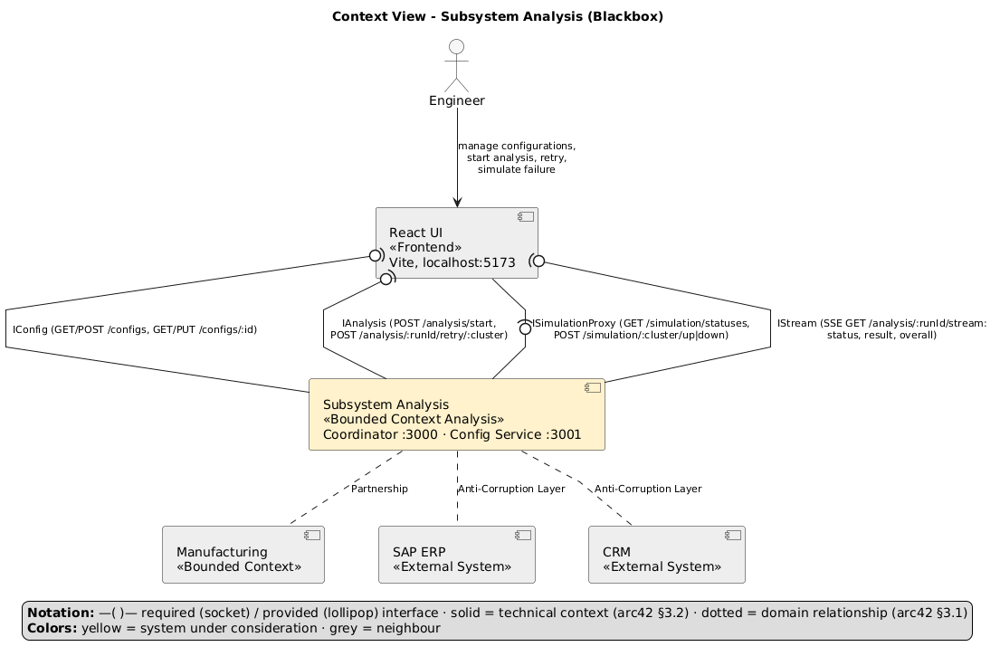
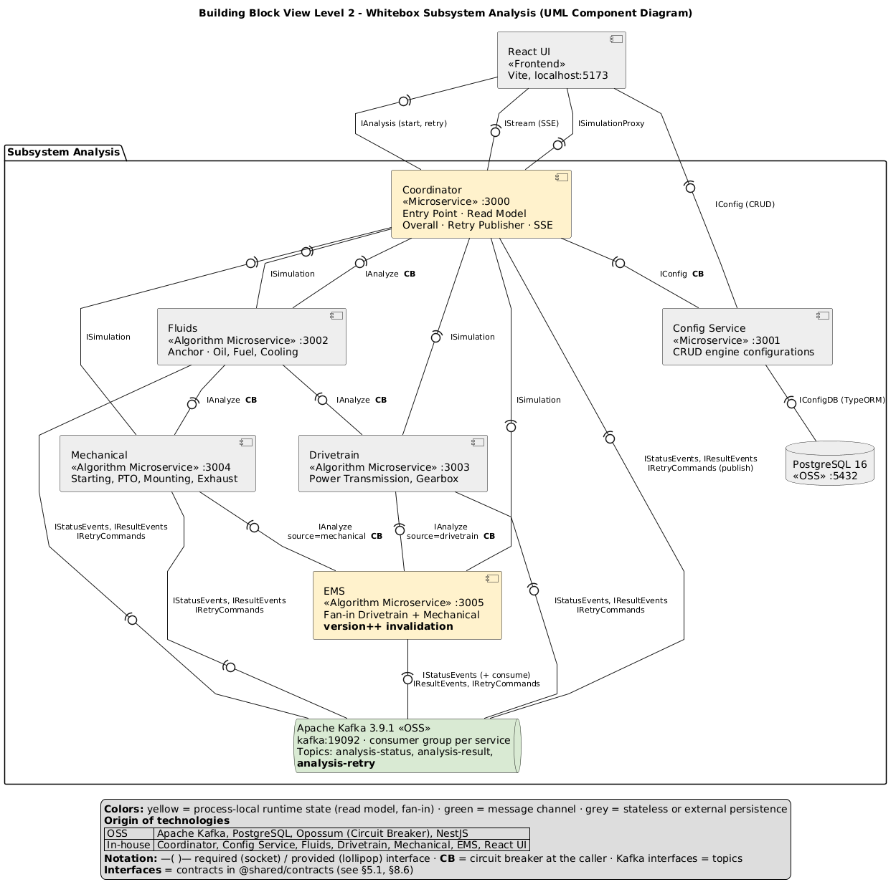
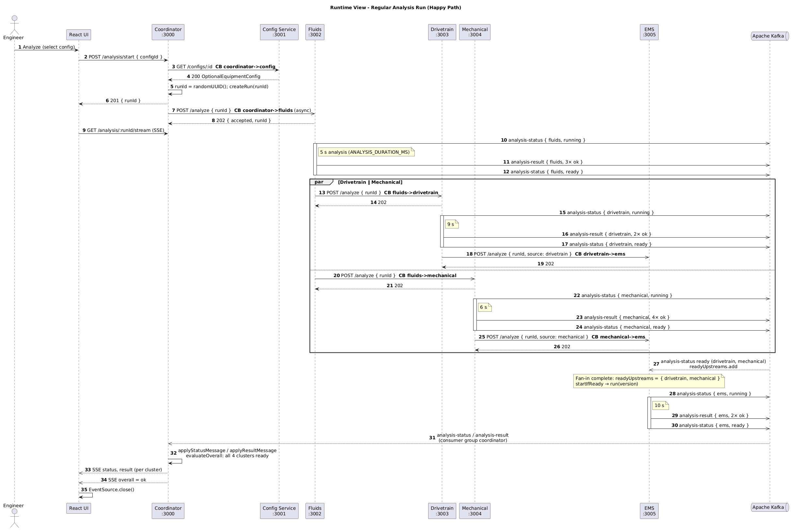
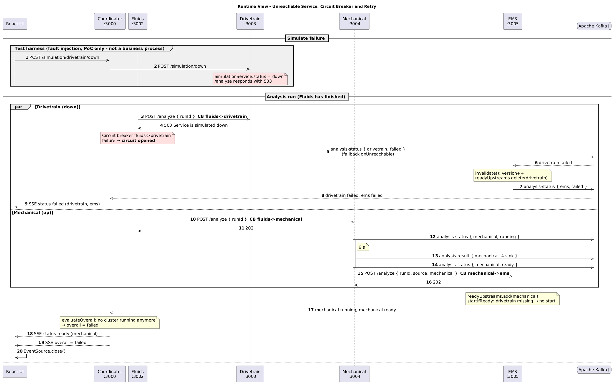
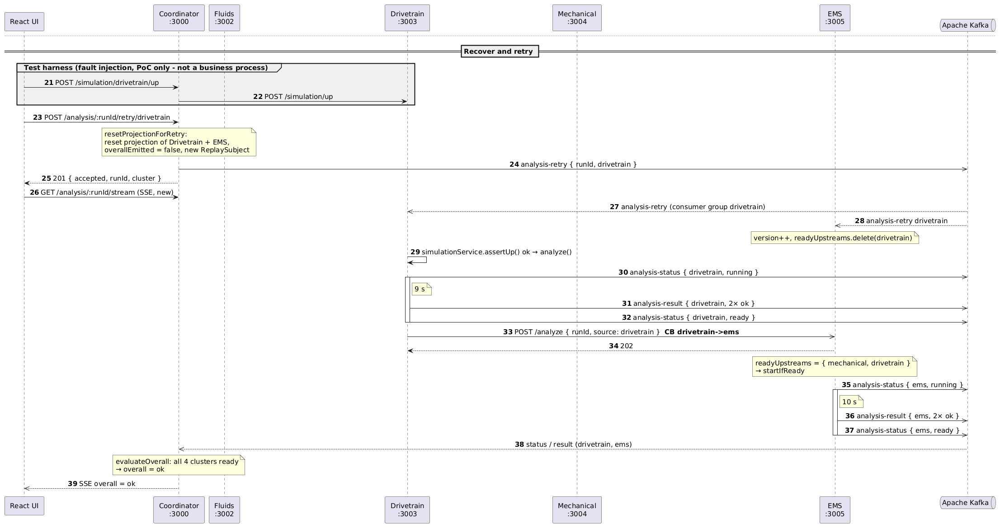
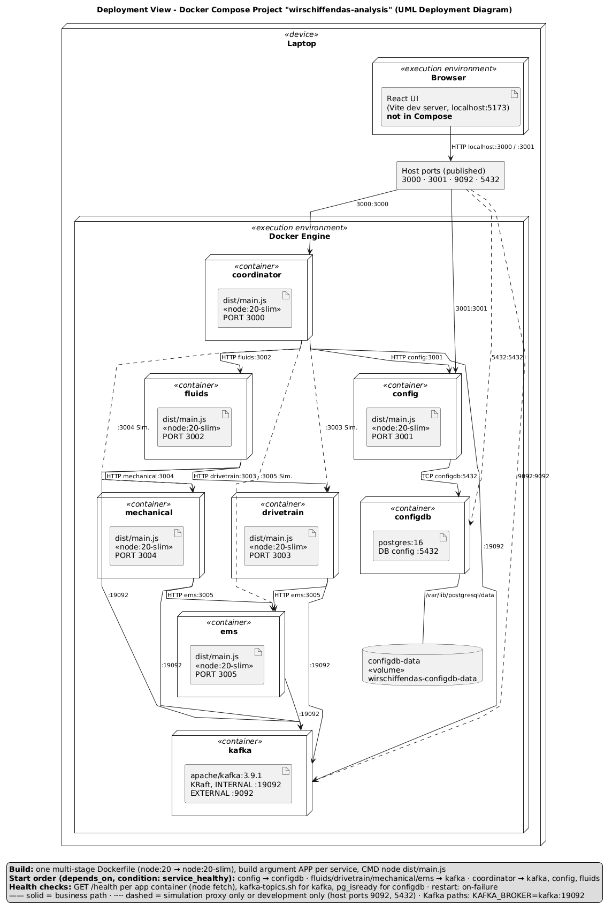

# arc42 Architecture Documentation: Analysis of the Optional Equipment

## 1. Introduction and Goals

### 1.1 Requirements Overview

The application is a proof of concept for the analysis of an optional equipment configuration of the yacht engine family "Diesel Engine 2000 M96", distributed across the four algorithm services Fluids, Drivetrain, Mechanical and EMS. A React frontend manages configurations, starts analysis runs, shows status and results and allows the retry of a single algorithm.

| Requirement | Implementation |
|---|---|
| Input of an optional equipment configuration | React dialog for engine model, cylinder variant, gearbox type and the eleven equipment groups |
| Persistent management of configurations | Config service with its own PostgreSQL database via TypeORM; `/configs` creates, reads and updates |
| Analysis button starts an anchor algorithm, the call stays responsive | `POST /analysis/start` checks the configuration, creates the `runId`, starts only Fluids asynchronously and returns immediately |
| Choreographed microservices, sequential and parallel via REST | Fluids starts Drivetrain and Mechanical in parallel, both report to EMS; no central process instance |
| At least four algorithms as independent services | Four clusters by physical assembly groups: Fluids, Drivetrain, Mechanical, EMS |
| EMS builds on previous results | Fan-in: EMS starts only when Drivetrain and Mechanical have been reported ready for the same `runId` |
| Result per equipment and overall result | Each cluster publishes one `EquipmentResult` per equipment group; after the terminal status of all four clusters the coordinator computes `overall` |
| Status `running` / `ready` / `failed` pushed proactively via one endpoint | Kafka topic `analysis-status` feeds the run projection, the coordinator pushes it via SSE |
| Circuit breaker, failure simulation and targeted retry | Opossum on all six REST edges between the services; fault injection via `POST /simulation/:cluster/down|up`; the retry addresses `runId` and cluster and is executed by the service |
| REST endpoints per microservice | `/analyze` per algorithm service, `/configs` in the config service, `/analysis` and `/simulation` in the coordinator, `/health` everywhere |

### 1.2 Quality Goals

| Priority | Quality goal (ISO 25010) | Scenario | Implementation |
|---|---|---|---|
| 1 | Responsiveness (Time Behaviour) | `POST /analysis/start` responds in < 500 ms with `runId`, independent of the algorithm duration (5–10 s) | asynchronous anchor start, SSE push |
| 2 | Resilience (Fault Tolerance) | Failure of a service leads within ≤ 5 s (CB timeout) to `failed` for this cluster and the dependent EMS, the others continue | circuit breaker at the caller, fallback publishes status |
| 3 | Observability (Analysability) | Every status change is visible in the UI ≤ 1 s after it occurs | Kafka `analysis-status` → coordinator → SSE |

Secondary, but demonstrated, are recoverability via the retry per cluster (QS-3) and modifiability: a new cluster costs one more NestJS application and one entry each in the cluster enum, in `RETRY_PROJECTION_SCOPE` and in Compose.

### 1.3 Stakeholders

Four roles carry the requirements: management expects a proof of concept for microservices against the position of the engineering department; the engineer expects visible status per algorithm, individual retry and monitoring while components stay responsive; the software architect expects evidence that the analysis component can be decomposed without blocking Manufacturing; operations expects container deployment and health checks (implemented) as well as central logging and monitoring (open, §11).

## 2. Constraints

The backend consists of six NestJS 11 applications in TypeScript on Node.js 20 in containers, the frontend of React 18, Vite 5 and Material UI 5. Persistence and messaging are provided by PostgreSQL 16 with TypeORM (`synchronize: true`) and Apache Kafka 3.9.1 via the NestJS Kafka transport. Resilience is handled by the Opossum circuit breaker with 5 s timeout, 50 % error threshold and 10 s reset time without a set `volumeThreshold` (default 0), so that the first failure already opens the breaker. Delivery is via Docker Compose.

## 3. Context and Scope

### 3.1 Business Context

The PoC implements the bounded context *Analysis* of the company's target architecture. It is in a partnership with *Manufacturing* and is separated from SAP ERP and CRM by an anti-corruption layer. The context view shows the subsystem as a blackbox; chapter 5 opens it into six building blocks, and `IAnalysis` corresponds to the coordinator endpoint.

### 3.2 Technical Context

The UI uses three REST interfaces: the config service (`GET/POST /configs`, `GET/PUT /configs/:id`), the coordinator (`POST /analysis/start`, `POST /analysis/:runId/retry/:cluster`) and its simulation proxy (`GET /simulation/statuses`, `POST /simulation/:cluster/up|down`); status, result and overall flow back as SSE via `GET /analysis/:runId/stream`. Between the services, `POST /analyze` with `AnalyzeRequest = { runId, source? }` represents the transitions of the choreography; `source` is only permitted for EMS and restricted there to Drivetrain or Mechanical. Kafka carries `analysis-status` (`{ runId, cluster, status }`, consumed by coordinator and EMS), `analysis-result` (`{ runId, cluster, results[] }`, by the coordinator) and `analysis-retry` (`{ runId, cluster }`, to the algorithm services) – each consumer with its own consumer group.

## 4. Solution Strategy

After checking that the configuration exists, the coordinator starts only the anchor Fluids; from then on the choreography continues decentrally via REST: Fluids starts Drivetrain and Mechanical in parallel, both report their completion independently to EMS, which only begins once the fan-in for the same `runId` is complete. All four services publish status and results via Kafka; the coordinator maintains a volatile read model per run from them and transmits changes as SSE. Resilience is local: the caller protects every automatic REST transition with a circuit breaker and publishes a technical call error as `failed` of the target cluster. The retry is decentralised as well – the coordinator only publishes a generic Kafka command. Persistence is separated: only the config service accesses PostgreSQL. The algorithms are simulated: 5, 6, 9 or 10 seconds of waiting time (`ANALYSIS_DURATION_MS`), fixed `ok` results.

**Assessment of the as-is architecture:** The as-is architecture was assessed against all 21 smells and anti-patterns of Schirgi & Brenner [1]. Four shaped this design: Isolation of Failures (circuit breaker locally), Mega Service / Wrong Cut (four business clusters), Shared Persistence (database per service), Hard-Coded Endpoints (Compose DNS instead of IPs). The anti-pattern Shared Libraries is deliberately accepted (TS-1).

## 5. Building Block View

The whitebox of the subsystem Analysis shows the six services, PostgreSQL, Kafka, the provided and required interfaces and the six REST edges protected by circuit breakers; the legend gives the colour coding (yellow = process-local runtime state, green = message channel, grey = stateless) and the origin of the technologies (OSS / in-house).

### 5.1 Whitebox Analysis Subsystem

| Building block | Responsibility | Dependencies |
|---|---|---|
| Coordinator | Config check, `runId`, anchor start, retry entry point, simulation proxy, run projection, overall, SSE | Config service, Fluids, Kafka; for simulation all algorithm services |
| Config service | CRUD and persistence of the engine configurations | PostgreSQL |
| Fluids | Analysis of Oil, Fuel and Cooling System; start of Drivetrain and Mechanical | Drivetrain, Mechanical, Kafka |
| Drivetrain | Analysis of Power Transmission and Gearbox Options; completion report to EMS | EMS, Kafka |
| Mechanical | Analysis of Starting System, Auxiliary PTO, Mounting and Exhaust System; completion report to EMS | EMS, Kafka |
| EMS | Fan-in of Drivetrain and Mechanical; analysis of Engine Management and Monitoring/Control System; invalidation of outdated attempts | Kafka |

Each interface of the diagram is exactly one contract in `analysis/libs/shared/src/contracts/` (§8.6). The provider implements it with `implements`, the consumer knows only the contract and receives the implementation via an injection token.

| Interface (diagram) | Contract (`@shared/contracts`) | Provided (code) | Required (code, injection token) | OpenAPI |
|---|---|---|---|---|
| IAnalyze | `analyze.ts`: `IAnalyze` | `FluidsController`, `DrivetrainController`, `MechanicalController`, `EmsController` (`POST /analyze`) | Coordinator `FluidsClient` → `FLUIDS_ANALYZE`; Fluids `DrivetrainClient` → `DRIVETRAIN_ANALYZE`, `MechanicalClient` → `MECHANICAL_ANALYZE`; Drivetrain and Mechanical `EmsClient` → `EMS_ANALYZE` | `api/{fluids,drivetrain,mechanical,ems}.openapi.json` |
| IConfig | `config.ts`: `IConfig`, subset `IConfigLookup` | `ConfigController` (`/configs`) | React UI (CRUD); Coordinator `ConfigClient` → `CONFIG_LOOKUP` (only `getConfig`) | `api/config.openapi.json` |
| ISimulation | `simulation.ts`: `ISimulation`, `ISimulationClient` | `SimulationController` in `@shared` (`/simulation/status\|down\|up`) | Coordinator `SimulationClient` → `SIMULATION_CLIENT` | `api/{fluids,drivetrain,mechanical,ems}.openapi.json` |
| IAnalysis | `analysis.ts`: `IAnalysis` | Coordinator `AnalysisController` (`POST /analysis/start`, `POST /analysis/:runId/retry/:cluster`) | React UI | `api/coordinator.openapi.json` |
| IStream | `analysis.ts`: `IStream` | `AnalysisController.stream` (SSE `/analysis/:runId/stream`) | React UI | `api/coordinator.openapi.json` |
| ISimulationProxy | `analysis.ts`: `ISimulationProxy` | Coordinator `SimulationController` (`/simulation/statuses`, `/simulation/:cluster/down\|up`) | React UI | `api/coordinator.openapi.json` |
| IStatusEvents | `events.ts`: `IStatusEvents`; publisher `IEventPublisher` | `EventController.onStatusEvent` (Coordinator, EMS) | `emitStatus` via `EVENT_PUBLISHER` (`KafkaClient`) in all algorithm services, breaker fallbacks, `ClusterGateway` | – (topic contract `TopicContracts`) |
| IResultEvents | `events.ts`: `IResultEvents`; publisher `IEventPublisher` | `EventController.onResultEvent` (Coordinator) | `emitResult` via `EVENT_PUBLISHER` in Fluids, Drivetrain, Mechanical, EMS | – (topic contract `TopicContracts`) |
| IRetryCommands | `events.ts`: `IRetryCommands`; publisher `IEventPublisher` | `EventController.onRetryEvent` (Fluids, Drivetrain, Mechanical, EMS) | `emitRetry` via `EVENT_PUBLISHER` in the Coordinator (`ClusterGateway.retry`) | – (topic contract `TopicContracts`) |

## 6. Runtime View

### 6.1 Regular Analysis Run

The happy path from the start via the anchor Fluids and the parallel execution of Drivetrain and Mechanical to the fan-in in EMS and the `overall` event takes about 25 s.

### 6.2 EMS Fan-in

EMS accepts at `/analyze` only `source = drivetrain` or `source = mechanical` in any order, because a set stores the ready upstreams per `runId`. In addition, EMS consumes `analysis-status`: a `ready` adds to the same set, a `failed` invalidates the attempt, removes the upstream and publishes `failed` for EMS. Execution starts only when the fan-in is complete; multiple reports do not lead to parallel runs because of `Set`, `running` and `completed`.

### 6.3 Retry

Read-side invalidation in the coordinator (`RETRY_PROJECTION_SCOPE`):

| Retry of | Reset projection |
|---|---|
| Fluids | Fluids, Drivetrain, Mechanical, EMS |
| Drivetrain | Drivetrain, EMS |
| Mechanical | Mechanical, EMS |
| EMS | EMS |

### 6.4 Unreachable Service and Circuit Breaker

| Call | Circuit breaker | Fallback in code |
|---|---|---|
| Coordinator → Config service | `coordinator->config` | no fallback, but an `errorFilter`: 404 as "Config not found", otherwise "Config service unavailable". |
| Coordinator → Fluids | `coordinator->fluids` | `failFluidsChain` publishes `failed` for Fluids, Drivetrain and Mechanical; EMS follows with its own `failed`. |
| Fluids → Drivetrain | `fluids->drivetrain` | `failed` for Drivetrain. |
| Fluids → Mechanical | `fluids->mechanical` | `failed` for Mechanical. |
| Drivetrain → EMS | `drivetrain->ems` | `failed` for EMS. |
| Mechanical → EMS | `mechanical->ems` | `failed` for EMS. |

The circuit breaker does not repeat the business run: it bounds the REST call and translates unreachability into a technical cluster status. The explicit retry remains separate from it.

Failure: circuit breaker fluids→drivetrain opens, EMS invalidates

Recovery and targeted retry

## 7. Deployment View

Docker Compose starts eight containers: the six NestJS applications from the same multi-stage Dockerfile (`node:20` for the build, `node:20-slim` at runtime, `ARG APP`), `apache/kafka:3.9.1` as KRaft broker and `postgres:16` with the volume `wirschiffendas-configdb-data`. Published to the host are 3000 (coordinator), 3001 (config service) and, for development, 9092 (Kafka) and 5432 (PostgreSQL). Every application container has a `healthcheck` on `GET /health`; via `depends_on: service_healthy` the algorithm containers wait for Kafka, the config service for PostgreSQL, the coordinator for Kafka, config service and Fluids. Compose does not build the React UI.

## 8. Crosscutting Concepts

### 8.1 Circuit Breaker

The shared Opossum implementation offers the decorator `@CircuitBreaker(name, fallbackMethod)` for the service clients and the factory `createCircuitBreaker(...)` for the `ClusterGateway`, which knows `ConfigClient` and `FluidsClient` only via `IConfigLookup` and `IAnalyze` respectively; the fallback publishes `failed`, but no synthetic results.

### 8.2 Status Telemetry via Kafka

`KafkaClient` implements `IEventPublisher` and encapsulates the three topics: the algorithm services produce status and results, the coordinator consumes both for its read model, EMS the upstream status.

### 8.3 Server-Sent Events

`AnalysisService` holds a process-local `ReplaySubject(50)` per `runId` and forwards status, result and overall as SSE; after the overall the UI closes the stream.

### 8.4 Invalidation of Outdated EMS Runs

Every EMS run has a monotonically increasing `version`: failure or retry of an upstream increments it and invalidates the running attempt, which then discards its result.

### 8.5 Failure Simulation

`POST /simulation/:cluster/down|up` sets the state of a service whose `/analyze` then responds with 503 – a PoC variant of the Test Harness pattern according to Nygard (chapter 5). In production the trigger is a real failure; the breakers behave the same.

### 8.6 Interfaces as Contracts (Provided/Required)

The contracts are separated from the components and live in `@shared/contracts`; the rest of the library (`http`, `kafka`, `circuit-breaker`, `simulation`, …) is infrastructure. Required interfaces are injected as an abstraction: services and `ClusterGateway` depend via `@Inject(TOKEN)` on the contract, not on a client class. The `@Module` is the assembler that binds each token to an implementation – tokens instead of abstract classes, because TypeScript interfaces do not exist at runtime and Fluids needs two bindings of the same `IAnalyze`. Provided interfaces are enforced by `implements` on the controller; every service publishes them as OpenAPI 3 under `/api-docs-json` (UI under `/api-docs`), the exported documents are in `docs/api/`. The Kafka topics are typed via `TopicContracts`, so that a message can only be published on its topic. Limitation: the TypeScript contract is bound to language and monorepo (TS-1); only the generated OpenAPI document is independent of the component.

## 9. Architecture Decisions

| ADR | Decision | Considered alternatives | Consequence |
|---|---|---|---|
| ADR-001: Choreography instead of central orchestration | The coordinator starts only the anchor Fluids; Fluids starts Drivetrain and Mechanical, both report to EMS. The coordinator does not know the flow, but knows the expected result set (read model). | central orchestration as orchestrator or saga process manager; completion report by the last step ("last step reports done"). Rejected: choreography required, coordinator otherwise a single point of failure, a reporting final step wires the order again. | Happy path decentralised, order open, EMS needs local state; the run projection is observation. |
| ADR-002: Coexistence of REST and Kafka | REST `/analyze` represents the transitions, Kafka transports status, results and retry, SSE the aggregated view. | REST only with callback or polling; Kafka only, which would remove the immediate acceptance of a start; WebSocket instead of SSE. | REST edges can be protected locally by breakers, Kafka decouples the UI projection; operations needs a broker. |
| ADR-003: Decentralised retry as Kafka command | The coordinator cleans up its read model and publishes `{ runId, cluster }` on `analysis-retry`; the service interprets it itself. | executing the retry in the coordinator via REST; repeating the entire run; sending the command via REST. | The coordinator remains the entry point; a retry of Fluids continues the choreography, EMS invalidates subsequent states. |
| ADR-004: Reduced `AnalyzeRequest` | Only `runId` and optionally `source` for the EMS fan-in; the configuration stays in the config service. | carrying the configuration in the request; passing on upstream results; letting every service load the configuration itself. | The contract matches the data need; the results are simulated, not computed from equipment values (TS-6). |
| ADR-005: Circuit breaker at the caller with status fallback, without service registry | Opossum breaker at the caller instead of at the target (Nygard, chapter 5); the fallback publishes `failed`, discovery via Compose DNS. | Hystrix with Eureka (JVM, end of life); Resilience4j (JVM); breaker in the target; Consul as registry; dummy fallback. | Resilience emerges locally per edge (§6.4); scaling requires a registry or service mesh (TS-4), publishing another service's status is TS-5. |
| ADR-006: Business cut into four clusters, Fluids as anchor, EMS as fan-in | Cut by physical assembly groups: Fluids (three groups), Drivetrain (two), Mechanical (four), EMS (two). | eleven services, one per equipment (Nano Service); a single analysis service as in the as-is architecture (Mega Service); anchor in the coordinator. | The call graph is a DAG; a new cluster costs one entry each in the cluster enum, in `RETRY_PROJECTION_SCOPE` and in Compose. |
| ADR-007: Persistence only for the configuration, runtime state volatile | Database per service only for the config service (PostgreSQL 16); run projection and EMS fan-in are held process-locally in memory. | shared database for all services (Shared Persistence); Redis for the projection; event sourcing with replay. | Coordinator and EMS are not horizontally scalable, a restart loses running runs (TS-4). |
| ADR-008: Deployment with Docker Compose from a monorepo with a shared Dockerfile | Eight containers: six NestJS applications, Kafka, PostgreSQL; all images from the same multi-stage Dockerfile via `ARG APP`. | cloud platform such as SEPP or Kubernetes; separate repository and Dockerfile per service; schema registry instead of shared types. | Reproducible start with one command; independent deployability limited by the shared library (TS-1). |

## 10. Quality Requirements

| ID | Stimulus | System response | Measure |
|---|---|---|---|
| QS-1 | UI starts analysis | `runId` returned, algorithms run in the background | response time < 500 ms |
| QS-2 | Drivetrain is `down` | Fluids CB opens and publishes `failed` for Drivetrain; Mechanical continues; EMS `failed` | ≤ 5 s until status, no blocking |
| QS-3 | Retry Drivetrain after `up` | Only Drivetrain and EMS run again, the other results remain | projection resets exactly 2 clusters |
| QS-4 | Kafka unreachable at start | Services do not start (`depends_on`), no inconsistent state | known limitation, see §11 |

## 11. Risks and Technical Debt

| Debt / risk | Justification in the PoC | Countermeasure |
|---|---|---|
| **TS-1** Shared library with domain code (cluster, equipment, DTOs, messages); one Dockerfile for all services [Shared Libraries, IV.B.2] | Contract shared at build time, not at runtime; one team, one release cycle | Contracts in a schema registry; separate `package.json` per service |
| **TS-2** UI calls coordinator and config service directly [No API Gateway, IV.B.3] | Two endpoints in the PoC; a gateway would be a pure proxy | API gateway / BFF, as modelled in the target architecture |
| **TS-3** Logging only to stdout, no central logging, no monitoring [Local Logging, Insufficient Monitoring, IV.B.4] | Outside the PoC scope | Loki/Grafana or ELK; correlation ID = `runId` is available |
| **TS-4** Run projection in memory (`ReplaySubject`), EMS fan-in in `Map` [Horizontal Scalability, IV.A.4] | State is run-local and short-lived (ADR-007) | Projection in Redis; persist EMS state; partitioning by `runId` |
| **TS-5** Caller publishes `failed` for an unreachable target service [Status Ownership, own observation] | Run must become terminal; the target cannot publish anything (ADR-005) | Separate status `unreachable` instead of `failed` |
| **TS-6** Algorithms do not read the configuration; result always `ok` [ADR-004] | Simulation of the flows, not of the business logic | One cluster reads the config and returns `failed` for a combination |
| **TS-7** No API versioning, no CI/CD pipeline [No API Versioning, No CI/CD, IV.B.3] | PoC, one consumer | `/v1/` prefix; GitLab CI with build/test/push per service |
| **TS-8** `TypeORM synchronize: true` [ – ] | PoC | Migrations |
| **TS-9** Read model completes a run only after all expected predecessors have reported; a timeout for missing reports is lacking [ – ] | Call errors are reported by the breaker as `failed`; a silently missing report keeps the run open | Timeout per run in the projection, then `failed` |
| **TS-10** Kafka contracts only as TypeScript types (`TopicContracts`), no AsyncAPI document; no consumer-driven contract tests [ – ] | Producers and consumers in the same monorepo, the compiler checks both sides | AsyncAPI for the three topics; Pact tests for REST and Kafka |
| **R-1** Kafka at-least-once: duplicate status messages possible [ – ] | EMS idempotent via `version`, coordinator via `overallEmitted` | Message key = `runId`, deduplication in the consumer |
| **R-2** Kafka as single point of failure: services do not start without Kafka; on failure status and results are lost [ – ] | deliberate PoC limitation | Replication; outbox pattern; timeout for hanging runs |

### 11.1 Retrospective

A central API alone does not turn an architecture into orchestration; what matters is whether it knows the flow and the recovery – and the coordinator deliberately does not (ADR-001). Circuit breakers protect automatic calls but do not perform a retry: repetition remains a business decision (ADR-003, ADR-005). What would be done differently is the handling of the contracts – schema registry instead of a shared library (TS-1).

## References

[1] T. Schirgi, E. Brenner, "Quality Assurance for Microservice Architectures", 2021.
