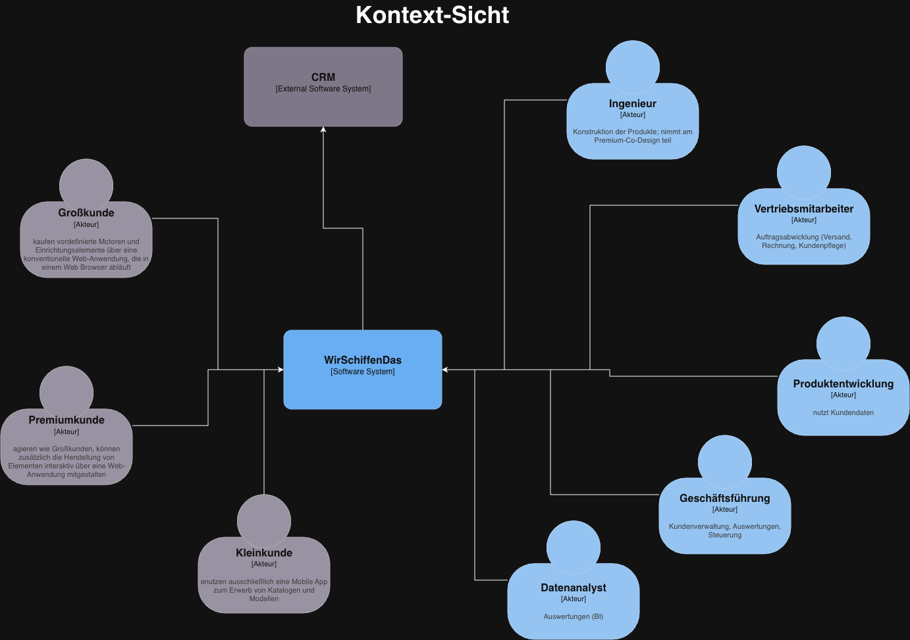
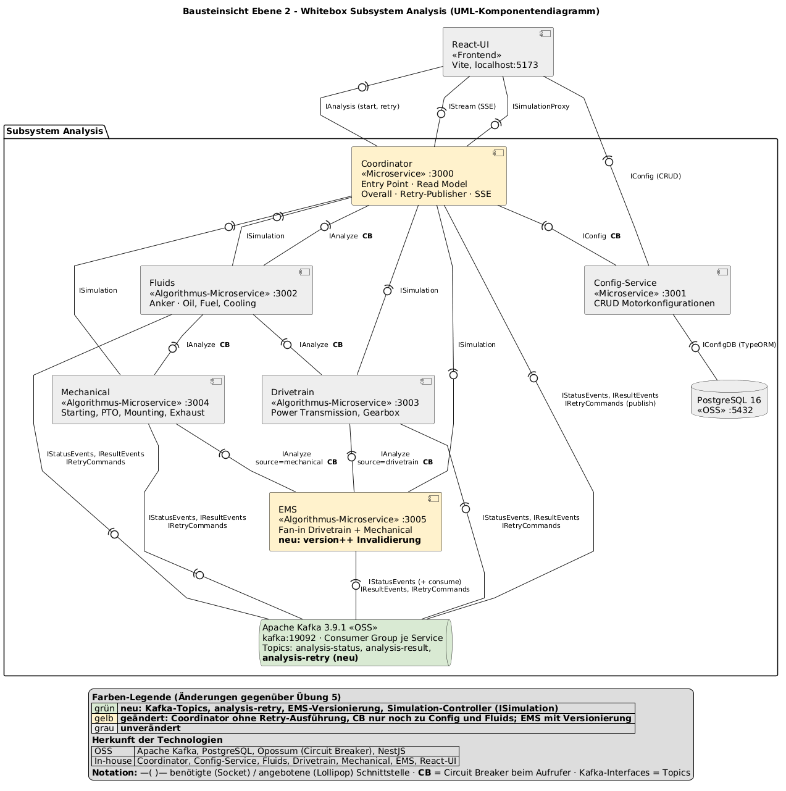
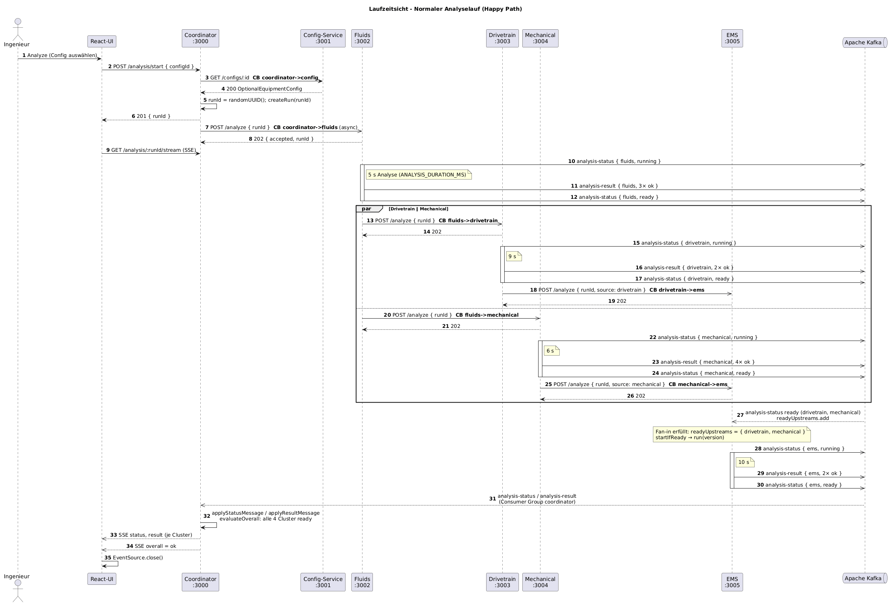
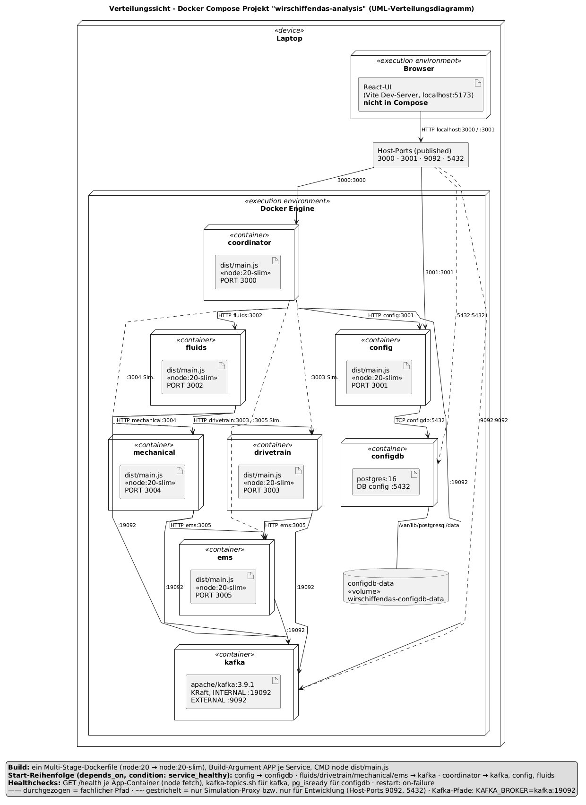

# Analyse des Optional Equipments als Microservice-Choreografie

**Semesterprojekt „Microservices“ · SEKA SS 2026 · Fallstudie WirSchiffenDas GmbH & Co KGaA**

Proof of Concept für die Analyse-Komponente der Komponente „Manufacturing Products“
(Diesel Engine 2000 M96, elf Optional Equipments in vier Algorithmus-Clustern)

Umgesetzt: **MS_TA1** Apache Kafka · **MS_TA2** Docker Compose · **MS_TA3** Circuit Breaker (Opossum)

Stack: NestJS 11 / TypeScript · Apache Kafka 3.9.1 · PostgreSQL 16 · Opossum · React 18 + Vite · Docker Compose

Nihad Jabrayilzade · Hochschule Bonn-Rhein-Sieg · Prüfer: Prof. Dr. Sascha Alda

<div class="foot">Dokumentation: docs/arc42.md · Code: analysis/ (Backend), analysis-ui/ (Frontend)</div>

---

<!-- _class: small -->

## Fachliche Anforderungen (Übung 5)

<div class="quote">„… für jedes optionale Equipment ein eigenständiger und abgeschlossener Algorithmus … in einer Choreographie nebenläufig abarbeiten? Die übrigen Komponenten sollten also responsive bleiben! Möchte auch gerne die aktuellen Status der einzelnen Algorithmen sehen … Auch ein Retry eines einzelnen Algorithmus sollte möglich sein.“ — Ingenieur, Case Study Folie 12</div>

<div class="two">
<div>

- <span class="ok">✓</span> Eingabe einer Optional-Equipment-Konfiguration [React-UI]
- <span class="ok">✓</span> Konfiguration persistent verwalten [Config-Service, PostgreSQL]
- <span class="ok">✓</span> Analyse per Button startet einen Anker-Algorithmus [Coordinator → Fluids]
- <span class="ok">✓</span> Choreografierte Microservices, sequenziell und parallel über REST [Fluids → Drivetrain ‖ Mechanical → EMS]
- <span class="ok">✓</span> Mindestens 4 Algorithmen als eigene Services [Fluids, Drivetrain, Mechanical, EMS]

</div>
<div>

- <span class="ok">✓</span> EMS baut auf vorherigen Ergebnissen auf [EMS Fan-in]
- <span class="ok">✓</span> Result je Equipment + Gesamtergebnis [alle Cluster, Coordinator `overall`]
- <span class="ok">✓</span> Status `running` / `ready` / `failed` proaktiv über designierten Endpunkt [Kafka `analysis-status` → SSE]
- <span class="ok">✓</span> Circuit Breaker und Ausfallsimulation [Opossum, `/simulation`]
- <span class="ok">✓</span> REST-Endpoints je Microservice [`/analyze`, `/configs`, `/analysis`]

</div>
</div>

---

<!-- _class: small -->

## Kontext: Bounded Context *Analysis*



- Kontextsicht der Firma (Übung 4b): Ingenieur, Kunden, Geschäftsführung, SAP ERP, CRM
- PoC = Bounded Context **Analysis** aus der Context Map (Übung 4c)
- Manufacturing → Analysis: Customer/Supplier; `IAnalysis` = Coordinator
- ACL zu SAP ERP / CRM außerhalb des PoC

---

<!-- _class: small -->

## Bausteinsicht (UML)



- 6 Services, Kafka, PostgreSQL
- Lollipop / Socket = Schnittstellen
- **CB** = 6 Circuit-Breaker-Kanten
- grün neu · gelb geändert · grau unverändert

---

<!-- _class: small -->

## Laufzeitsicht: Happy Path



Choreografie, keine Orchestrierung:

- Coordinator startet nur den Anker Fluids
- Fluids ruft Drivetrain ‖ Mechanical
- beide melden an EMS (Fan-in)
- Coordinator = Read Model + SSE, kennt den Ablauf nicht

---

## Verteilungssicht: Docker Compose



Acht Container, ein Dockerfile, `depends_on: service_healthy`

```text
SERVICE      STATUS
config       Up (healthy)   3001->3001
configdb     Up (healthy)   5432->5432
coordinator  Up (healthy)   3000->3000
drivetrain   Up (healthy)
ems          Up (healthy)
fluids       Up (healthy)
kafka        Up (healthy)   9092->9092
mechanical   Up (healthy)
```

`GET /health` je Service, Healthcheck per `node -e fetch(...)`

---

<!-- _class: small -->

## Entwurfsentscheidungen (arc42 §9)

**ADR-001 Choreografie statt zentraler Orchestrierung** — Kontext: Der Coordinator ist der zentrale HTTP-Einstieg, die Aufgabe verlangt aber eine Choreografie der Algorithmus-Services. → Entscheidung: Der Coordinator startet nur den Anker Fluids. Fluids startet Drivetrain und Mechanical; diese melden sich selbst bei EMS. EMS besitzt die Fan-in-Regel. → Konsequenz: Der Happy Path bleibt dezentral. Die zentrale Run-Projektion ist Beobachtung und nicht Ablaufsteuerung.

**ADR-002 Koexistenz von REST und Kafka** — Kontext: Startübergänge benötigen eine direkte Annahme oder Ablehnung; Status, Resultate und Retry sollen unabhängig von einer offenen HTTP-Kette verteilt werden. → Entscheidung: REST `/analyze` bildet die automatischen Übergänge der Choreografie ab. Kafka transportiert Status, Resultate und Retry-Kommandos. SSE überträgt die vom Coordinator aggregierte Sicht an den Browser. → Konsequenz: REST-Aufrufe können lokal durch Circuit Breaker geschützt werden. Kafka entkoppelt Produzenten von der UI-Projektion.

**ADR-003 Dezentraler Retry als Kafka-Kommando** — Kontext: Die UI benötigt einen einheitlichen Retry-Endpunkt, ohne dass der Coordinator die Wiederholungslogik jedes Algorithmus ausführt. → Entscheidung: Der Coordinator validiert den Clusternamen, bereinigt ausschließlich sein Read Model und publiziert `{ runId, cluster }` auf `analysis-retry`. → Konsequenz: Der Coordinator bleibt Entry Point und Projektion. Ein Retry von Fluids setzt die Choreografie fort; EMS verwaltet die Invalidierung abhängiger Zustände.

*ADR-004 Reduzierter `AnalyzeRequest` (nur `runId` + `source`) mündlich.*

---

<!-- _class: small -->

## Anti-Pattern Top-4 nach Schirgi & Brenner (Übung 6-1c)

| # | Anti-Pattern / Smell | IST-Architektur WirSchiffenDas | PoC |
|---|---|---|---|
| 5 | Isolation of Failures | Analyse blockiert Manufacturing, kein CB, kein Timeout | <span class="ok">ja</span> – Opossum-CB an 6 REST-Kanten, Timeout 5 s, Fallback `failed` (Demo) |
| 10 / 7 | Mega Service / Wrong Cut | eine Klasse für alle Algorithmen, Schnitt nach Schichten | <span class="ok">ja</span> – vier fachliche Cluster als eigene Services |
| 2 | Shared Persistence | eine zentrale DB für alle Komponenten | <span class="ok">ja</span> – PostgreSQL nur beim Config-Service |
| 1 | Hard-Coded Endpoints | feste IP-Adressen (100.2.33.255/products) | <span class="ok">ja</span> – Compose-DNS + `environment.ts` |

Bewertung aller 21 Zeilen in arc42 Anhang C · 12 von 21 Lösungen im PoC umgesetzt, 1 teilweise

<span class="warn">Offen (TS-1):</span> `libs/shared` teilt Domänen-Code (Cluster, Equipment, DTOs) – Anti-Pattern *Shared Libraries*, bewusst in Kauf genommen (Build-Zeit-Kopplung, ein Team)

---

## Code-Walkthrough

<div class="cols">
<div>

`analysis/libs/shared/src/circuit-breaker/CircuitBreaker.ts`

```ts
const DEFAULT_OPTIONS: OpossumBreaker.Options = {
  timeout: 5_000,
  errorThresholdPercentage: 50,
  resetTimeout: 10_000,
};
// …
  if (fallback) {
    breaker.fallback(fallback);
  }

  const logger = new Logger(`CircuitBreaker:${name}`);
  breaker.on("failure", (error: Error) =>
    logger.warn(`call failed: ${error.message}`),
  );
  breaker.on("open", () => logger.warn("circuit opened"));
```

</div>
<div>

`analysis/apps/ems/src/service/EmsService.ts` – `startIfReady` / `run`

```ts
    if (run.running || run.completed || !this.hasAllUpstreams(run)) {
      return false;
    }

    const version = run.version;
    run.running = true;

    void this.run(runId, run, version).then((completed) => {
      if (run.version !== version) {
        return;
      }

      run.running = false;
      run.completed = completed;
    });
// … run():
    await new Promise((resolve) => setTimeout(resolve, ANALYSIS_DURATION_MS));

    if (run.version !== version) {
      return false;
    }
```

</div>
<div>

`analysis/apps/coordinator/src/gateway/ClusterGateway.ts` – `retry`

```ts
  retry(runId: string, cluster: string) {
    if (!Object.values(Cluster).includes(cluster as Cluster)) {
      throw new BadRequestException(`Unknown cluster "${cluster}".`);
    }

    const retriedCluster = cluster as Cluster;

    this.analysisService.resetProjectionForRetry(runId, retriedCluster);
    this.kafkaClient.emitRetry({
      runId,
      cluster: retriedCluster,
    });
```

</div>
</div>

---

## Demo

1. `docker compose ps` → acht Container `(healthy)`
2. UI (`localhost:5173`): **Create Config** → **Analyze** → Status `Running` je Cluster, Resultate, `overall = ok` (~25 s)
3. `curl -X POST localhost:3000/simulation/drivetrain/down`
4. **Analyze** erneut → `docker compose logs fluids`: `CircuitBreaker:fluids->drivetrain circuit opened` → UI: Drivetrain und EMS `Failed`, `overall = failed`
5. `curl -X POST localhost:3000/simulation/drivetrain/up`
6. UI: **Retry** bei Drivetrain → Drivetrain `Running` → EMS `Running` → `overall = ok`

Skript: `docs/demo.md` · Fallback: Bildschirmvideo (90 s) auf dem Desktop

---

<!-- _class: small -->

## Fazit · Lessons Learned · Restriktionen · Ausblick

<div class="two">
<div>

**Lessons Learned**
- Eine zentrale API macht eine Architektur noch nicht zur Orchestrierung – entscheidend ist, ob sie Ablauf und Recovery-Regeln kennt
- Circuit Breaker schützen automatische HTTP-Aufrufe, führen aber keinen Retry aus; Retry ist eine explizite Benutzeraktion
- Ein Fan-in braucht lokalen Zustand (Set, `running`/`completed`, `version`) – das ist keine Orchestrierung

**Ausblick**
- API Gateway / BFF vor Coordinator und Config-Service
- Zentrales Monitoring und Logging (Loki/Grafana), Correlation-ID = `runId`
- Config-getriebene Ergebnisse statt immer `ok`; KI-Erklärung von `failed` über MCP

</div>
<div>

**Restriktionen (arc42 §11)**
- TS-1 `libs/shared` teilt Domänen-Code; ein `package.json`, ein Dockerfile
- TS-2 UI ruft Coordinator und Config-Service direkt, kein Gateway
- TS-3 `/health` und Compose-Healthchecks – erledigt
- TS-4 Logging nur stdout je Container, kein Monitoring
- TS-5 Run-Projektion und EMS-Zustand in-memory, nicht horizontal skalierbar

</div>
</div>
