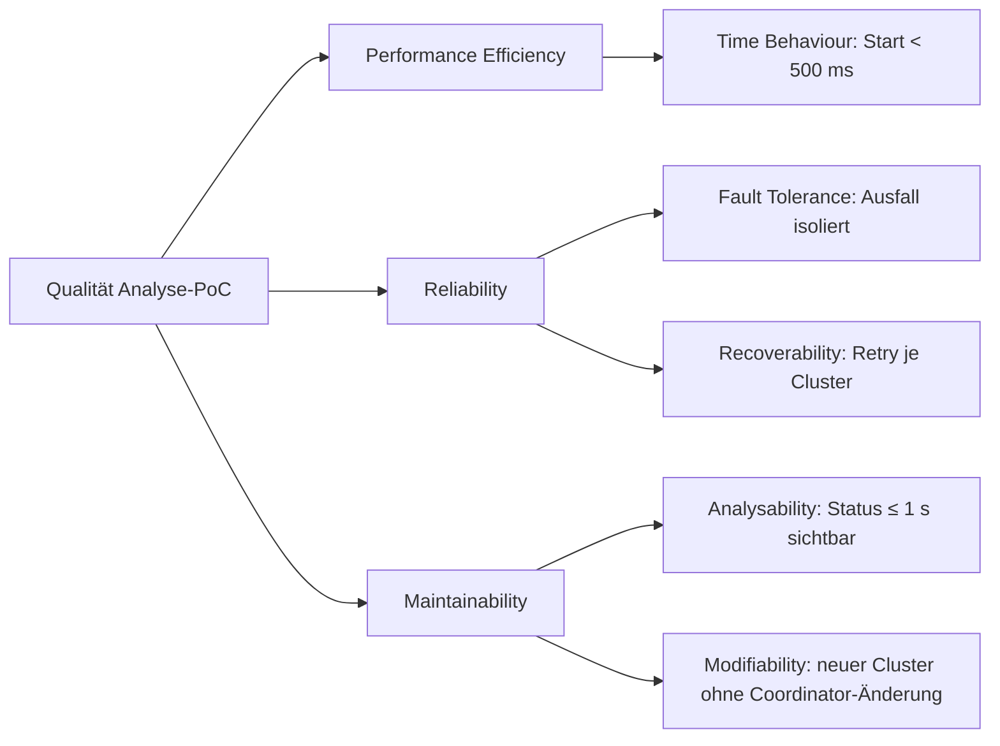
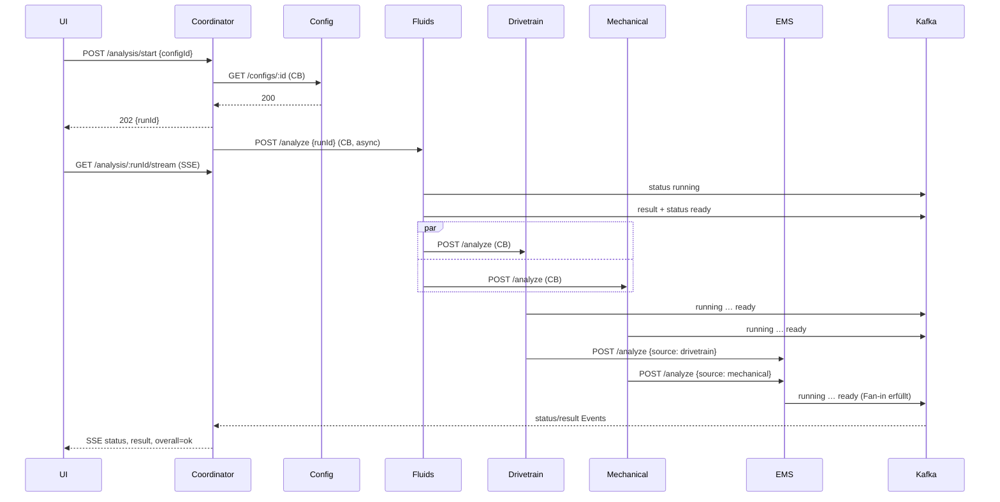
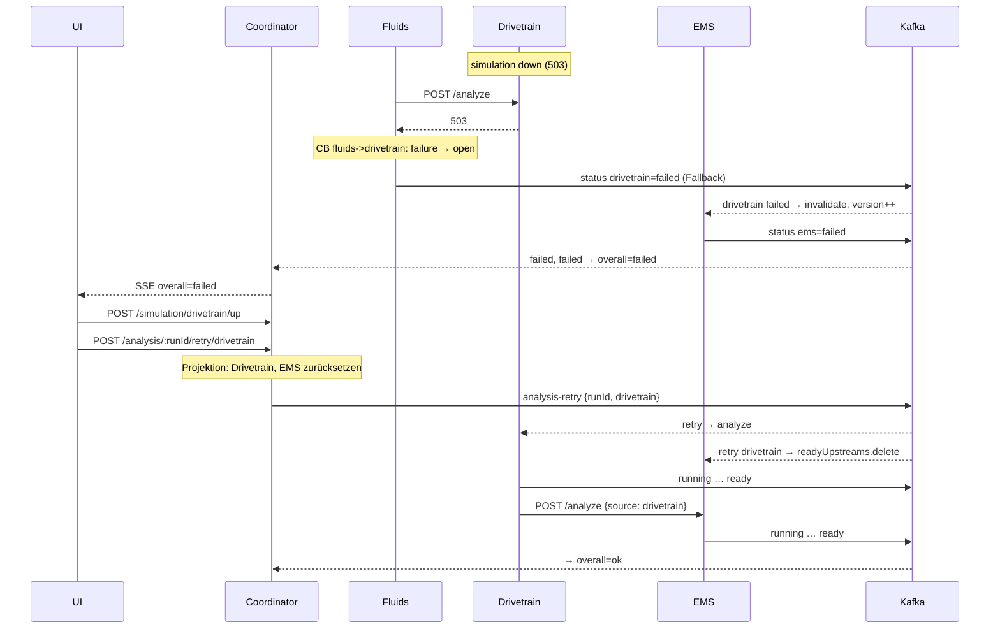

# SEKA Gap-List: WirSchiffenDas Semesterprojekt

2026-09-18 · @Nihad Jabrayilzade

## Обзор: шесть gaps, ничего в коде переписывать не надо

Реализация закрывает Ü5 полностью и все три MS\_TA (Kafka, Docker Compose, Circuit Breaker). Не хватает документации и артефактов Ü4/Ü6-1, которые Alda проверяет по чеклисту Übungsblatt 8. Источник требований: Ü8 S. 1–3, Ü4 Aufgabe 1 a–e, Ü6 Aufgabe 1 a–c, Hinweise zur mündlichen Prüfung Folie 6–7.

| # | Gap | Категория | Куда идёт результат | Оценка времени |
| --- | --- | --- | --- | --- |
| 1 | arc42 §1.2/1.3, §10, §11, §12 отсутствуют; нет PDF со встроенными диаграммами | обязательно | arc42-Upload (20 % проекта) | 3–4 ч |
| 2 | Ü4a Statements и Ü4e KI-Vision нет текстом | обязательно | arc42 Anhang или §1/§2 | 1 ч |
| 3 | Anti-Pattern-Tabelle без колонки «im PoC umgesetzt», без Insufficient Monitoring, без Top-4 | обязательно | arc42 §11 + слайд | 1 ч |
| 4 | Нет UML: Komponentendiagramm с Interfaces, Sequenzdiagramm, Verteilungsdiagramm, Farben-Legende | обязательно | arc42 §5–7 + слайды | 3–4 ч |
| 5 | Нет `/health` — единственный дешёвый Must из твоей же таблицы | 15 минут | код + Compose | 0,25 ч |
| 6 | Handout и структура Vortrag по Ü8 | обязательно | Handout-Upload + Vortrag (80 % проекта) | 2 ч |
| — | Экзаменационные ответы на слабые места (Shared Libraries, Status-Ownership, CB, Kafka, SAGA) | подготовить устно | §11 одной строкой + голова | 1 ч |
| — | Klassendiagramm, README, UI в Compose, API-Versioning | опционально | — | по остатку |

Два загружаемых файла на LEA, оба не позднее чем за день до экзамена: Assignment «Upload arc42-Dokumentation für die Prüfung» (\~5 стр. PDF) и Assignment «Upload Handout für die Prüfung» (PDF слайдов или arc42 Communication Canvas). Уведомление о теме и Schwerpunkt должно было уйти Alda до 14.09 — если нет, письмо сегодня.

## Gap 1: arc42 достроить до 12 разделов и отдать как PDF

`docs/arc42.md` обрывается на §9. Ü8 требует «wesentliche Aspekte (Architekturmodelle, Entwurfsentscheidungen usw.)», Fragenkatalog — Qualitätsattribute и Trade-offs, а именно §10 и §11 их несут. Текущие §1–9 не трогать, только добавить.

### §1.2 Qualitätsziele (quality goals) — вставить после §1.1

Таблица трёх–пяти целей по ISO 25010 с Szenario. Готовый фрагмент, подгони цифры:

```markdown
### 1.2 Qualitätsziele

| Priorität | Qualitätsziel (ISO 25010) | Szenario | Umsetzung |
|---|---|---|---|
| 1 | Reaktionsfähigkeit (Time Behaviour) | `POST /analysis/start` antwortet in < 500 ms mit `runId`, unabhängig von der Dauer der Algorithmen (5–10 s) | asynchroner Anker-Start, SSE-Push |
| 2 | Widerstandsfähigkeit (Fault Tolerance) | Ausfall eines Algorithmus-Services führt innerhalb von 5 s (CB-Timeout) zu `failed` für genau diesen Cluster; übrige Cluster laufen weiter | Circuit Breaker beim Aufrufer, Fallback publiziert Status |
| 3 | Beobachtbarkeit (Analysability) | Jeder Statuswechsel (`running/ready/failed`) ist ≤ 1 s nach Eintritt in der UI sichtbar | Kafka `analysis-status` → Coordinator → SSE |
| 4 | Wiederherstellbarkeit (Recoverability) | Retry eines einzelnen Clusters ohne Neustart des gesamten Runs; abhängige Cluster (EMS) werden invalidiert | `analysis-retry`, EMS-Versionierung |
| 5 | Modifizierbarkeit (Modifiability) | Ein neuer Algorithmus-Cluster kommt als eigener Service ohne Änderung an Coordinator hinzu | Choreografie, generische Topics |
```

### §1.3 Stakeholder — вставить после §1.2

```markdown
### 1.3 Stakeholder

| Rolle | Erwartung |
|---|---|
| Geschäftsleitung WirSchiffenDas | Proof of Concept für Microservices gegen die Haltung der Abteilung Technik |
| Ingenieur (Konfigurator) | Status je Algorithmus sichtbar, Retry einzeln, übrige Komponenten bleiben responsiv, Monitoring |
| Software-Architekt Entwicklungsteam | Nachweis, dass Analyse-Komponente ohne Blockade von Manufacturing zerlegbar ist |
| Betrieb | Container-Deployment, Health, zentrales Logging (offen, siehe §11) |
| Prüfer (Prof. Alda) | arc42, 4-Sichten-Modell in UML, Begründung über Patterns/Anti-Patterns |
```

### §10 Qualitätsanforderungen

Qualitätsbaum (quality tree) как Mermaid + таблица сценариев. Сценарии = те же пять из §1.2, но с измеримым Stimulus/Response; §1.2 даёт приоритет, §10 — проверяемость.

````markdown
## 10. Qualitätsanforderungen

### 10.1 Qualitätsbaum



### 10.2 Qualitätsszenarien

| ID | Stimulus | System-Reaktion | Messgröße |
|---|---|---|---|
| QS-1 | UI startet Analyse | `runId` zurück, Algorithmen laufen im Hintergrund | Antwortzeit < 500 ms |
| QS-2 | Drivetrain ist `down` | Fluids-CB öffnet, publiziert `failed` für Drivetrain; Mechanical läuft weiter; EMS `failed` | ≤ 5 s bis Status, kein Blockieren anderer Cluster |
| QS-3 | Retry Drivetrain nach `up` | Nur Drivetrain + EMS laufen erneut, Fluids/Mechanical-Resultate bleiben | Projektion setzt genau 2 Cluster zurück |
| QS-4 | Kafka nicht erreichbar beim Start | Services starten nicht (`depends_on`), kein inkonsistenter Zustand | bekannte Grenze, siehe §11 |
````

### §11 Risiken und technische Schulden

Самый важный новый раздел для экзамена: здесь признаёшь анти-паттерны собственного решения до того, как Alda их найдёт. Каждая строка — одна Schuld, одно обоснование, одна Gegenmaßnahme. Готовый текст:

```markdown
## 11. Risiken und technische Schulden

| # | Schuld / Risiko | Bezug (Schirgi & Brenner) | Begründung im PoC | Gegenmaßnahme |
|---|---|---|---|---|
| TS-1 | `libs/shared` enthält Domänen-Code (Cluster, Equipment, DTOs, Messages); ein `package.json`, ein Dockerfile für alle Services | Anti-Pattern Shared Libraries (IV.B.2) | Monorepo-Build: Vertrag wird zur Build-Zeit geteilt, nicht zur Laufzeit; ein Team, ein Release-Zyklus | Kontrakte in Schema Registry (Avro/JSON Schema) auslagern; pro Service eigenes `package.json`; Domänen-Enums nicht mehr teilen |
| TS-2 | UI ruft Coordinator und Config-Service direkt auf | No API Gateway (IV.B.3) | Zwei Endpunkte für einen PoC; Gateway wäre reiner Proxy | API Gateway / BFF vor Coordinator + Config, wie in der SOLL-Architektur der Firma modelliert |
| TS-3 | Kein `/health` in den Services; Compose-Healthcheck nur für Kafka/PostgreSQL | No Health Check (IV.B.4) | — | `GET /health` je Service; Compose `healthcheck` je Service (erledigt, wenn Gap 5 umgesetzt) |
| TS-4 | Logging nur auf stdout je Container, kein zentrales Logging, kein Monitoring | Local Logging, Insufficient Monitoring (IV.B.4) | Ausserhalb des PoC-Scopes; Ingenieur fordert Monitoring | Loki/Grafana oder ELK; Correlation-ID = `runId` ist bereits in jeder Nachricht |
| TS-5 | Coordinator hält Run-Projektion in-memory (`ReplaySubject`), EMS hält Fan-in-Zustand in `Map` | Horizontal Scalability (IV.A.4) | Zustand ist run-lokal und kurzlebig | Projektion in Redis; EMS-Zustand persistieren; Kafka-Partitionierung nach `runId` |
| TS-6 | Aufrufer publiziert `failed` für einen nicht erreichbaren Zielservice (z. B. Fluids für Drivetrain) | Status-Ownership (eigene Beobachtung) | Run muss einen terminalen Zustand erreichen; Ziel kann selbst nichts publizieren | Eigener Status `unreachable` statt `failed`, um technische von fachlicher Störung zu trennen |
| TS-7 | Algorithmen lesen die Konfiguration nicht; Ergebnis immer `ok` | ADR-004 | Simulation der Abläufe, nicht der Fachlogik | Ein Cluster liest Config und liefert `failed` für eine definierte Equipment-Kombination |
| TS-8 | Keine API-Versionierung, keine CI/CD-Pipeline im Repository | No API Versioning, No CI/CD (IV.B.3) | PoC, ein Konsument | `/v1/`-Prefix; GitLab-CI mit Build/Test/Push je Service |
| TS-9 | `TypeORM synchronize: true` | — | PoC | Migrations |
| R-1 | Kafka at-least-once: doppelte Status-Nachrichten möglich | — | EMS idempotent über `version`, Coordinator über `overallEmitted` | Message-Key = `runId`, Deduplikation im Consumer |
```

### §12 Glossar

Десять строк: Cluster, Anker-Algorithmus, Run/`runId`, Choreografie vs. Orchestrierung, Fan-in, Circuit Breaker, Read Model/Projektion, Consumer Group, SSE, Optional Equipment. По одной фразе.

### Диаграммы и PDF

§5 ссылается на `.drawio` — в PDF это мёртвая ссылка. Экспортируй из diagrams.net каждую страницу как PNG (File → Export as → PNG, Zoom 200 %) в `docs/img/` и вставь `` в §3 (Kontext = Ebene 1), §5 (Ebene 2), §6 (Sequenzdiagramme из Gap 4), §7 (Verteilungsdiagramm). PDF: `pandoc arc42.md -o arc42.pdf --pdf-engine=xelatex -V geometry:margin=2cm` или Markdown-Preview → Print → PDF в VS Code. Целевой объём \~5–7 страниц: таблицу портов §2.2 и таблицу Compose §7 можно сократить до одного предложения каждую, они дублируют диаграммы.

## Gap 2: Ü4a Statements и Ü4e KI-Vision — час работы, оба в arc42

Ü4a требует 2–3 предложения на каждый из восьми Statements, Ü4e — короткую KI-Vision. В репо ни того, ни другого. Место: новый раздел `## Anhang A: Bewertung der Statements (Übung 4a)` и `## Anhang B: KI-Vision (Übung 4e)` в конце arc42 — Alda разрешил сокращать шаблон, добавлять Anhang не запрещено. Половина аргументов уже лежит в твоей CSV в колонке «Bewertung IST-Architektur», просто вынеси их.

| Statement | Тезис ответа (2–3 предложения на немецком) | Источник для аргумента |
| --- | --- | --- |
| 1 Komponenten-/Schichtenteams übernehmen | Нет: Conway's Law — Schicht-Teams воспроизводят Schicht-Schnitt = Anti-Pattern Wrong Cut. Рекомендация: cross-funktionale Feature-Teams je Bounded Context (Unterauer 2017). Твой PoC: один Team владеет Analysis целиком, включая UI | CSV #7; Kap. 2 Conway |
| 2 Geschäftsführung nicht informieren, KI unbedenklich | Нет: Microservices — organisatorische Entscheidung (Teams, Betrieb, Kosten für Kafka/Container/Monitoring), не «geringfügige Architekturänderung». KI-Support требует Governance (Daten, Haftung) | Kap. 2 Probleme/Limitierungen; CSV #13 |
| 3 Cloud-ready = horizontal skalierbar | Нет: eine VM = ein Deployment-Artefakt; репликация только целиком. Shipping (Sommer) и Analyse требуют индивидуального Scaling → Smell Horizontal Scalability + Independent Deployability | CSV #3, #4 |
| 4 Beschwerden des API-Teams über GP-API | Причины: God-API — serverseitige UI-Aggregation, Business-Logik, alle Channels в одной компоненте, ein Team als Engpass. Решение: API Gateway + Backend-for-Frontend je Channel (Newman) — как в твоей SOLL-Bausteinsicht (Kunden-Web-BFF, Mobile-BFF …) | CSV #6, #16; WirSchiffenDas.drawio |
| 5 Analyse-Komponente ist DAS Problem | Проблемы: все Algorithmen в одной Klasse (Mini-Mega-Service), synchroner Aufruf ohne Timeout блокирует Manufacturing, kein Status, kein Retry, Log nur lokal. Стратегия: ровно твой PoC — Choreografie je Cluster, asynchron, Status über Kafka, CB, Retry | CSV #5, #10, #17, #20; Case Study Folie 12 |
| 6 Universales Datenmodell | Нет: DDD — pro Bounded Context eigenes Modell, Integration über Context Map (Customer/Supplier, ACL zu SAP/CRM). Manufacturing-Team hat sich schon dagegen ausgesprochen → не все команды за | CSV #2; Context-Map в drawio (ACL к SAP ERP, CRM) |
| 7 Stolz auf moderne CI/CD | Нет: GitHub-Repo für Shared Libraries + manuelles Deployment ohne Quality Gates = Versionskontrolle, keine Pipeline. Плюс Shared Libraries сами Anti-Pattern | CSV #11, #15 |
| 8 Order-Fulfillment auf solidem Fundament | Нет: manueller Prozess über heterogene UIs, keine Transaktionsgrenzen, kein Orchestrator/Saga. Твоя SOLL-архитектура: Order-Fulfillment-Orchestrator + MCP-Server | CSV #14; Kap. 6 |

KI-Vision (Ü4e) — пять–семь предложений, привязанных к тому, что уже нарисовано: KI-Assistant и MCP-Server в SOLL-Bausteinsicht. Тезисы: (1) LLM-Agent через MCP-Tools запускает Order-Fulfillment и Analyse (`POST /analysis/start`, `retry`) по запросу на естественном языке; (2) Erklärung von `failed`-Resultaten: LLM читает `analysis-result` и Config и формулирует Handlungsempfehlung для Ingenieur; (3) Anomalie-Erkennung на Status-Stream (Kafka) — какие Cluster чаще падают; (4) Grenze: KI не принимает Freigabe-Entscheidung, только Vorschlag — из-за Haftung в Schiffbau. Подчеркнуть, что Statement 2 (KI unbedenklich) этим опровергается.

## Gap 3: Anti-Pattern-Tabelle — одна колонка, одна строка, один слайд

Ü6-1c: «mindestens zwei Lösungen in den Prototyp einfließen, die vier höchst priorisierten vorführen». Твоя `docs/Anti patterns.csv` оценивает только IST; колонка «Notwendige Muster (Kapitel 4)» во всех 20 строках «noch offen». Alda увидит, что задание сделано наполовину, хотя фактически реализовано пять решений.

Что сделать в CSV (потом таблица целиком в arc42 §11 или Anhang C):

1. Заменить «noch offen» на конкретный Pattern из Kap. 4/5 там, где он есть: #1 → Service Discovery via Compose-DNS; #2 → Database per Service; #3 → Container per Service; #5 → Circuit Breaker (Nygard); #17 → Timeout (Nygard); #14 → Konfiguration über Environment; остальные → «kein Pattern im PoC».
2. Добавить колонку **«Im PoC umgesetzt?»** со значениями `ja` / `teilweise` / `nein` + одно предложение с файлом. Заполнение ниже.
3. Добавить строку **#21 Insufficient Monitoring** (IV.B.4): IST — Monitoring-Komponente nur «wünschenswert»; Lösung — globales Monitoring-Tool; Prio Must (Ingenieur fordert es); PoC — `nein`, siehe TS-4.

| # | Smell / Anti-Pattern | Im PoC umgesetzt? | Nachweis |
| --- | --- | --- | --- |
| 1 | Hard-Coded Endpoints | ja | URLs nur über `environment.ts` + Compose-Servicenamen (`http://drivetrain:3003`) = «gut konfiguriertes DNS-System, Ports in Konfigurationsdatei» — zweite Lösung nach Schirgi & Brenner |
| 2 | Shared Persistence | ja | Nur Config-Service besitzt PostgreSQL; Algorithmus-Services sind zustandslos bzgl. Persistenz |
| 3 | Independent Deployability | ja | Ein Container pro Service, `restart: on-failure`; Einschränkung: `depends_on: kafka` und gemeinsames Image, siehe TS-1 |
| 4 | Horizontal Scalability | nein | Coordinator/EMS stateful in-memory, siehe TS-5 |
| 5 | Isolation of Failures | ja | Opossum-CB an allen 6 automatischen REST-Übergängen, Fallback publiziert `failed` |
| 6 | Decentralization | ja | Choreografie: Coordinator startet nur den Anker, kennt den Ablauf nicht (ADR-001) |
| 7 | Wrong Cut | ja | Schnitt nach fachlichen Equipment-Gruppen (Fluids, Drivetrain, Mechanical, EMS), nicht nach Schichten |
| 8 | Cyclic Dependency | ja | Aufrufgraph ist ein DAG: Coordinator → Fluids → {Drivetrain, Mechanical} → EMS |
| 9 | Nano Service | ja | Vier Cluster für elf Equipments statt elf Services |
| 10 | Mega Service | ja | Analyse-Klasse des IST in vier Services zerlegt |
| 11 | Shared Libraries | nein | `libs/shared` mit Domänen-Code, siehe TS-1 |
| 12 | Too many standards | ja | Genau drei Protokolle mit klarer Rolle: REST (Übergänge), Kafka (Events/Commands), SSE (UI) — ADR-002 |
| 13 | Too new technology | ja | NestJS 11, Kafka 3.9, PostgreSQL 16, Opossum — etabliert |
| 14 | Manual Anti-Pattern | teilweise | Konfiguration über Env-Variablen, kein Config-Server; Deployment per `docker compose up` |
| 15 | No CI/CD | nein | Keine Pipeline im Repo, siehe TS-8 |
| 16 | No API Gateway | nein | UI → Coordinator und Config direkt, siehe TS-2 |
| 17 | Timeouts | ja | CB-Timeout 5 s an jedem REST-Aufruf |
| 18 | No API Version | nein | Siehe TS-8 |
| 19 | No Health Check | nein → ja nach Gap 5 | `GET /health` je Service |
| 20 | Local Logging | nein | stdout je Container, siehe TS-4 |
| 21 | Insufficient Monitoring | nein | Siehe TS-4 |

Top-4 для слайда (Ü6-1c «vorführen und erläutern»): #5 Isolation of Failures — демо: Drivetrain `down` → CB открывается в логе Fluids → `failed` в UI; #10/#7 Mega Service/Wrong Cut — Baustein-Sicht IST (eine Klasse) vs. SOLL (vier Cluster); #2 Shared Persistence — Config-DB только у Config; #1 Hard-Coded Endpoints — `docker-compose.yml` environment-блок. Порядок именно такой: первый показывается живьём, остальные — на диаграмме.

## Gap 4: UML — четыре диаграммы, самый большой блок работы

Ü8 прямо: «Verwenden sie dazu die Modellierungssprache UML (z.B. Komponenten-, Verteilungs-, Klassendiagramm)». Ü6-1b: 4-Sichten-Modell с Farben-Legende для изменений относительно Ü5. Сейчас у тебя: Kontextsicht/Bausteinsicht/Context Map фирмы в UML (хорошо), но Bausteinsicht PoC Ebene 2 — boxes-and-lines без Interfaces, Laufzeitsicht — текст, Verteilungssicht — таблица. Порядок по отдаче: 4.1 → 4.2 → 4.3 → 4.4.

### 4.1 Komponentendiagramm Ebene 2 в UML-нотации (1,5 ч)

Переделать `Baustein-Sicht.drawio` Ebene 2 в diagrams.net с UML-Shape-Library: `<<component>>` на каждом из шести сервисов, provided Interface (Lollipop) и required Interface (Socket) как у тебя в `WirSchiffenDas.drawio`. Interfaces назвать по контрактам из §3.2:

| Komponente | provided | required |
| --- | --- | --- |
| Coordinator | `IAnalysis` (start, retry, stream), `ISimulationProxy` | `IConfig`, `IAnalyze` (Fluids), `ISimulation` ×4, `IStatusEvents`, `IResultEvents`, `IRetryCommands` (Kafka) |
| Config-Service | `IConfig` (CRUD) | `IConfigDB` (PostgreSQL) |
| Fluids | `IAnalyze`, `ISimulation` | `IAnalyze` (Drivetrain, Mechanical), `IStatusEvents`, `IResultEvents`, `IRetryCommands` |
| Drivetrain, Mechanical | `IAnalyze`, `ISimulation` | `IAnalyze` (EMS), Kafka ×3 |
| EMS | `IAnalyze`, `ISimulation` | `IStatusEvents`, `IResultEvents`, `IRetryCommands` |
| Apache Kafka | `IStatusEvents`, `IResultEvents`, `IRetryCommands` (Topics) | — |

Farben-Legende (Ü6-1b) на той же диаграмме: зелёный = neu gegenüber Ü5 (Kafka-Topics, `analysis-retry`, EMS-Fan-in-Versionierung, Simulation-Controller), жёлтый = geändert (Coordinator: Retry-Ausführung entfernt, CB nur noch zu Config/Fluids — это твой «erster Konfliktpunkt» из presentation-story), серый = unverändert. Плюс вторая легенда OSS/COTS: Kafka, PostgreSQL, Opossum = OSS. Alda в Ü6 это явно просил.

### 4.2 Два Sequenzdiagramme для §6 (1 ч)

Mermaid рендерится в Markdown-Preview и экспортируется в PNG через mermaid.live. Первый — Happy Path, второй — Ausfall + Retry. Вставить в §6.1 и §6.3/6.4 вместо части текста.





### 4.3 Verteilungsdiagramm для §7 (45 мин)

UML Deployment: один `<<device>>` Host (Laptop), внутри `<<execution environment>>` Docker Engine, внутри восемь `<<node>>` контейнеров с `<<artifact>>` (`dist/main.js` образ `node:20-slim`, `apache/kafka:3.9.1`, `postgres:16`), Kommunikationspfade с Port-Labels (3000–3005, 19092, 5432), Volume `configdb-data` как `<<artifact>>`. Отдельным Node снаружи — Browser с React-UI (Vite dev, localhost) с пометкой «nicht in Compose». Таблицу §7 после этого сократить до двух предложений.

### 4.4 Связка SOLL-Architektur фирмы ↔ PoC (15 мин, текст)

В §3.1 одно предложение: «Der PoC realisiert den Bounded Context *Analysis* aus der Context Map (Anhang / WirSchiffenDas.drawio); der dort als Blackbox modellierte `Analysis-Service` ist hier als Whitebox mit sechs Bausteinen ausgeführt. `IAnalysis` entspricht dem Coordinator-Endpunkt.» И на Kontext-Sicht фирмы подсветить Analysis-Service той же зелёной рамкой. Без этого предложения диаграммы фирмы выглядят как отдельная работа, не связанная с кодом.

## Gap 5: `/health` — 15 минут кода, закрывает Must #19 и даёт healthcheck в Compose

Единственное изменение в коде, которое окупается: закрывает анти-паттерн из твоей же таблицы, делает `depends_on: condition: service_healthy` возможным между сервисами и даёт Alda ответ на «Wie erkennt Compose, dass ein Service bereit ist?». Без `@nestjs/terminus` — три файла в shared, один импорт в каждый Module.

```typescript
// analysis/libs/shared/src/health/HealthController.ts
import { Controller, Get } from "@nestjs/common";

@Controller("health")
export class HealthController {
  @Get()
  health() {
    return { status: "ok", uptime: process.uptime() };
  }
}
```

```typescript
// analysis/libs/shared/src/health/index.ts
export * from "./HealthController";
// и в libs/shared/src/index.ts добавить: export * from "./health";
```

В каждом `*Module.ts` (`ConfigModule`, `CoordinatorModule`, `FluidsModule`, `DrivetrainModule`, `MechanicalModule`, `EmsModule`) добавить `HealthController` в `controllers: [...]`. `SimulationController` там уже так подключён — тот же паттерн.

В `docker-compose.yml` для каждого из шести сервисов (образ `node:20-slim` без curl, поэтому через node):

```yaml
    healthcheck:
      test: ["CMD", "node", "-e", "fetch('http://localhost:3002/health').then(r=>process.exit(r.ok?0:1)).catch(()=>process.exit(1))"]
      interval: 10s
      timeout: 3s
      retries: 5
      start_period: 15s
```

Порт подставить свой (3000–3005). Тогда `coordinator` может ждать `fluids` и `config` через `condition: service_healthy`, а не только Kafka — это и есть демонстрация Independent Deployability с явными Startabhängigkeiten. Проверка: `docker compose ps` показывает `(healthy)`; на Code-Walkthrough это один слайд-скриншот. После этого в §11 строку TS-3 пометить `erledigt`, в CSV #19 → `ja`.

## Gap 6: Handout и Vortrag 10–13 минут по шести пунктам Ü8

Handout = PDF слайдов (или arc42 Communication Canvas), Upload за день до экзамена. Vortrag соло — 10–13 минут, дальше Alda прерывает. Порядок слайдов ниже ровно следует шести Bestandteile из Ü8, чтобы он мог ставить галочки. 11 слайдов, \~1 минута на слайд, демо 2–3 минуты.

| # | Слайд | Содержание | Мин |
| --- | --- | --- | --- |
| 1 | Titel | Projekt, Fallstudie, Schwerpunkt-Thema, Stack одной строкой | 0,5 |
| 2 | Fachliche Anforderungen | Zitat des Ingenieurs (Case Study Folie 12) + 6 Anforderungen aus Ü5 как чеклист: Anker, ≥4 Algorithmen, Choreografie parallel, Status running/ready/failed, Retry einzeln, CB. Каждая с ✓ | 1 |
| 3 | Kontext | Kontextsicht фирмы с подсвеченным Analysis Bounded Context + Context Map (Gap 4.4) | 1 |
| 4 | Bausteinsicht | UML-Komponentendiagramm Ebene 2 с Farben-Legende (Gap 4.1) | 1,5 |
| 5 | Laufzeitsicht | Sequenzdiagramm Happy Path (Gap 4.2) — здесь проговорить Choreografie vs. Orchestrierung | 1 |
| 6 | Verteilungssicht | Verteilungsdiagramm (Gap 4.3) + `docker compose ps (healthy)` | 1 |
| 7 | Entwurfsentscheidungen | ADR-001 Choreografie, ADR-002 REST + Kafka + SSE, ADR-003 dezentraler Retry — по одной строке Kontext → Entscheidung → Konsequenz; ADR-004 упомянуть устно | 1,5 |
| 8 | Anti-Pattern Top-4 | Таблица из Gap 3: was im IST, was im PoC gelöst; TS-1 Shared Libraries честно как offen | 1 |
| 9 | Code-Walkthrough | Три места: `CircuitBreaker.ts` (Decorator + Fallback), `EmsService.ts` (Fan-in + `version`), `ClusterGateway.retry` (3 Schritte). Скриншоты кода, не IDE | 1,5 |
| 10 | Demo | Живьём: Config anlegen → Start → Status в UI → Drivetrain `down` → CB в логе Fluids → `failed` → `up` → Retry Drivetrain → `overall=ok`. Запасной вариант: записанное видео 90 с | 2,5 |
| 11 | Fazit / Lessons Learned / Ausblick / Restriktionen | Lessons: «zentrale API ≠ Orchestrierung», Retry ≠ Circuit Breaker, Fan-in braucht Zustand. Restriktionen = TS-1…TS-5 одной строкой каждая. Ausblick: Gateway/BFF, Monitoring, Config-driven Ergebnisse | 1 |

Демо-скрипт держать в `docs/demo.md` с командами: `docker compose up -d --build`, `cd analysis-ui && npm run dev`, curl для `simulation/drivetrain/down`. За 15 минут до экзамена запустить Compose и один прогон — Kafka стартует \~20 с, первый Run иначе покажет `depends_on`-паузы. Второй вопрос, который Alda задаёт после демо почти всегда: «Was passiert, wenn Kafka ausfällt?» — ответ: Services ждут `service_healthy`, во время работы `emit` падает с ошибкой, статусы теряются, Run не терминируется; это R-1/TS-5 в §11.

Выступать на немецком; если он переключится на английский — Fachbegriffe уже в документе на обоих языках.

## Экзаменационные ответы на слабые места — не задачи, а формулировки

Это места, куда Alda копнёт на Code-Walkthrough или в 1–2 вопросах по проекту. Ничего не переписывать; каждая — одна строка в §11 (уже есть в Gap 1) и один отрепетированный ответ по схеме Definition → Abgrenzung → eigenes Beispiel → Trade-off.

**Shared Libraries (TS-1).** «Ja, `libs/shared` ist nach Schirgi & Brenner ein Implementation-Anti-Pattern. Ich habe es bewusst in Kauf genommen: die Bibliothek wird zur Build-Zeit eingebunden, jeder Container enthält seine eigene Kopie — kein Laufzeit-Coupling. Der Preis: eine Änderung an `AnalyzeRequest` erzwingt ein Rebuild aller sechs Services, Independent Deployability ist damit eingeschränkt. Alternative wäre Contract-Sharing über eine Schema Registry; für ein Team mit einem Release-Zyklus überwiegt der Nutzen der Typsicherheit.»

**Status-Ownership (TS-6).** «Wenn Fluids Drivetrain nicht erreicht, publiziert Fluids `drivetrain=failed`. Das ist ein bewusster Bruch der Ownership-Regel: der Zielservice kann selbst nichts publizieren, aber der Run muss terminieren, sonst hängt die UI. Sauberer wäre ein eigener Status `unreachable`, der technische von fachlicher Störung trennt — genau aus diesem Grund habe ich zuvor den Zustand `blocked` und synthetische Ergebnisse entfernt.»

**Circuit Breaker Zustandsmodell (Fragenkatalog, «modellieren und erklären»).** Нарисовать на листе: `closed` → (Fehlerquote ≥ 50 % im Rolling Window 10 s) → `open` → (resetTimeout 10 s) → `half-open` → Probe erfolgreich → `closed`, Probe fehlgeschlagen → `open`. Свои параметры: timeout 5 s, errorThresholdPercentage 50, resetTimeout 10 s. Честно про `volumeThreshold`: не задан, у Opossum по умолчанию 0, поэтому круг открывается уже после первого фейла — для демо желательно, для Produktion выставить ≥ 5. CB сидит у вызывающего (Nygard: «protect the client»), Fallback публикует статус, не повторяет вызов — Retry это отдельный, пользовательский Pattern.

**Kafka: Command vs. Event, at-least-once.** «`analysis-status` und `analysis-result` sind Events — Fakten, die passiert sind, mehrere Consumer (Coordinator, EMS). `analysis-retry` ist ein Command an genau einen fachlichen Empfänger, transportiert über Kafka, weil ich keinen zweiten Kanal wollte (Too many standards). Getrennte Consumer Groups pro Service, damit jeder Service jede Nachricht sieht. Kafka liefert at-least-once: EMS ist über `version` idempotent, der Coordinator über `overallEmitted`; Message-Key = `runId` würde Ordnung pro Run garantieren — das ist offen.» Commit Log / Offset объяснить на этом же примере: один Topic, одна Partition, Coordinator читает с своего Offset, EMS — со своего.

**Choreografie vs. Orchestrierung.** Твой лучший материал — `presentation-choreography-story.md`. Одна фраза: «Der Coordinator ist Entry Point und Read Model, kein Orchestrator: er kennt nach dem Anker weder Reihenfolge noch Recovery-Regeln. Ein Orchestrator (Camunda, Kap. 6) hätte den Ablauf zentral als Prozess.» Trade-off: Choreografie — lose Kopplung, aber Ablauf nur implizit sichtbar (deshalb das Read Model); Orchestrierung — Sichtbarkeit, aber zentraler Single Point of Failure und Kopplung an den Orchestrator.

**Transaktionen / SAGA (Fragenkatalog).** «Im PoC gibt es keine verteilte Transaktion: der einzige persistente Schreibzugriff ist der Config-Service. Ein Run ist eine Sequenz lokaler Schritte ohne ACID über Services hinweg — bei Ausfall gibt es keinen Rollback, sondern einen terminalen `failed`-Zustand und einen expliziten Retry als Vorwärts-Kompensation. Das entspricht einer Choreographie-Saga ohne Kompensationsschritte, weil die Algorithmen keine Seiteneffekte haben. Bräuchte Order Fulfillment (Billing, Shipping) echte Kompensation, wäre eine Orchestrierungs-Saga mit Camunda der richtige Weg.»

**Immer `ok` (TS-7, ADR-004).** «Der PoC simuliert die Abläufe, nicht die Fachlogik; die Aufgabe erlaubt Dummy-Werte. Die Konfiguration wird beim Start auf Existenz geprüft und bleibt im Config-Service — das reduziert den Vertrag auf `runId`. Fachliches `failed` würde eine Regel pro Cluster brauchen, z. B. Fluids: Oil System ohne Cooling System → `failed`.» Если есть 30 минут — реализовать ровно эту одну правило в `FluidsService`, тогда демо покажет и fachliches `failed`.

**«Warum kein Service Registry / Eureka?» (MS\_TA3).** «Compose-DNS löst Service-Namen auf; bei einer Instanz pro Service ist eine Registry Overhead. Sobald horizontal skaliert wird (TS-5), braucht man Registry oder einen Service Mesh — Eureka-Architektur: Client-seitige Registrierung, Heartbeat, Client-seitiges Load Balancing.» Eureka-архитектуру знать, Hystrix/Ribbon — не спрашивают.

## Опционально — только если Gaps 1–6 закрыты

Ни один из этих пунктов не снимает баллы сам по себе; каждый — либо красивее, либо страховка.

- Klassendiagramm (30 мин): `EmsRunState` + `Run`-Projektion + `Config`-Entity + `StatusMessage`/`ResultMessage`/`RetryMessage`. Ü8 называет его в скобках как пример; при наличии Komponenten- и Verteilungsdiagramm — не критично. Если делать — в §8 как иллюстрация к Fan-in-Invalidierung.
- README с запуском (20 мин): `docker compose up -d --build`, `npm run dev` для UI, три curl. Страховка для демо и для вопроса «wie starte ich das».
- Fachliches `failed` (30 мин): одно правило в `FluidsService` по конфигурации — см. TS-7. Единственный опциональный пункт, который реально улучшает демо.
- UI в Compose (45 мин): nginx-Image с `VITE_API_URL` через `.env`; закрывает hard-coded `localhost` в `api.ts`. Иначе — одна строка в §11.
- `/v1/`-Prefix через `app.setGlobalPrefix('v1')` (10 мин) — закрывает #18 формально, но UI и все клиенты придётся править; не стоит риска перед экзаменом.
- Тесты: не начинать. Alda не оценивает тесты в Microservices-проекте (в отличие от Java-EE-Migration), а полупустой `jest` выглядит хуже, чем его отсутствие.

## Порядок работы и чеклист загрузки

Порядок по отдаче на час: сначала то, что отсутствует и проверяется по чеклисту, потом то, что улучшает существующее. Всего \~12 часов чистой работы, не считая репетиции Vortrag.

- [ ] Gap 5: `/health` + Compose healthchecks — 15 мин, разогрев, сразу коммит
- [ ] Gap 3: CSV — колонка «Im PoC umgesetzt», строка #21, Muster вместо «noch offen» — 1 ч
- [ ] Gap 1: arc42 §1.2, §1.3, §10, §11, §12 вставить из готовых фрагментов — 1,5 ч
- [ ] Gap 2: Anhang A Statements, Anhang B KI-Vision — 1 ч
- [ ] Gap 4.1: Komponentendiagramm Ebene 2 в UML + Farben-Legende — 1,5 ч
- [ ] Gap 4.2: два Sequenzdiagramme из Mermaid → PNG — 1 ч
- [ ] Gap 4.3: Verteilungsdiagramm — 45 мин
- [ ] Gap 4.4: предложение-связка в §3.1 + подсветка Analysis в Kontextsicht — 15 мин
- [ ] Gap 1 финал: PNG в `docs/img/`, вставить в §3/5/6/7, сократить таблицы §2.2/§7, экспорт PDF, проверить объём 5–7 стр. — 1 ч
- [ ] Gap 6: 11 слайдов из готовых диаграмм + `docs/demo.md` — 2 ч
- [ ] Репетиция Vortrag с таймером дважды: цель 11–12 мин
- [ ] Ответы из раздела «Экзаменационные ответы» проговорить вслух на немецком, CB-Zustandsmodell нарисовать от руки один раз
- [ ] Опционально: fachliches `failed` в Fluids, README

За день до экзамена, оба на LEA:

- [ ] Assignment «Upload arc42-Dokumentation für die Prüfung» — `arc42.pdf`
- [ ] Assignment «Upload Handout für die Prüfung» — PDF слайдов

В день экзамена: ноутбук с USB-C и HDMI, Compose поднят за 15 мин до слота, один тестовый Run прогнан, запасное видео демо на рабочем столе.
